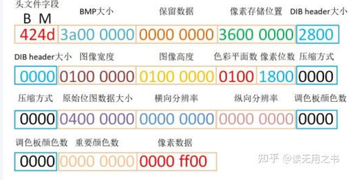

## BMP头

第2~5字节表示整个BMP文件的大小，小端模式
6~9字节是保留数据，一般都是0
10~13字节表示图片存储的位置（绿色部分），即0x00000036，即第54字节
14~17字节为位图信息数据头，一般是40，即0x00000028
30~33字节为压缩方式，0表示不压缩
34~37字节表示原始位图数据的大小，即0x00000004，即4字节
38~41字节表示横向分辨率
42~45字节表示纵向分辨率
46~49字节表示调色板颜色数
50~53字节表示重要颜色数
最后的54~57字节（红色部分）即原始的像素数据，这些才是最终需要显示到屏幕上的数据。
即便一个像素24位也需要4字节来表示，而最后的一个字节0为填充的空数据
是的，对于分辨率（Resolution）和位深（Bit Depth）均相同的两张 BMP 图片，它们的文件大小通常是完全一样

对于 **位深 24（RGB）**、分辨率为 **1080 × 2400** 的文件，其标准大小计算如下：

### 1. 纯像素数据 (RAW BIN) 大小
计算公式：宽 × 高 × (位深 / 8)
1080×2400×(24/8)=1080×2400×3
*   **计算结果**：**7,776,000 字节**
*   **约等于**：7.41 MB

---

### 2. 标准 BMP 图片文件大小
BMP 文件 = **54 字节文件头 (Header)** + **纯像素数据**
54+7,776,000=7,776,054 字节

1,097,856