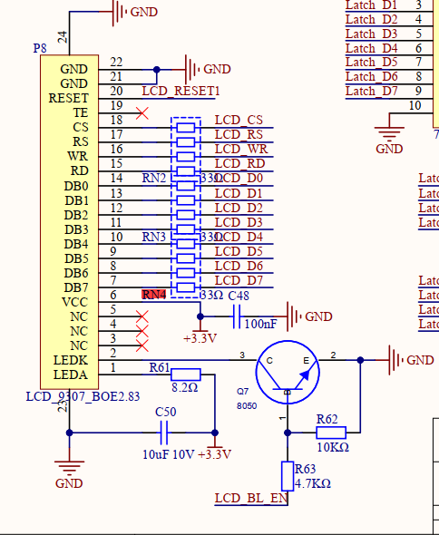

# MCU使用的外设FSMC（灵活静态存储控制器，Flexible Static Memory Controller）
## FSMC 的作用
是 STM32 等微控制器用来驱动外部并口设备（如 LCD、SRAM、NOR/NAND Flash）的硬件模块。
FSMC 可以把外部 LCD 显存映射到 MCU 的地址空间，实现高速并行读写。通过配置 FSMC，MCU 可以像访问内存一样访问 LCD

# 显示屏GC9307
GC9307 是一款常见的彩色 TFT(Thin Film Transistor) LCD 屏驱动芯片，支持 8080 并口（MCU接口）通信。
每个像素点都由一个独立的薄膜晶体管控制，实现精准的开关和灰度调节
OLED(OrganicLight-Emitting Diode)：无背光层，厚度仅0.1-1毫米，支持‌折叠/曲面屏
LCD(Liquid Crystal Display)：需背光模组，厚度3-5毫米，无法弯曲。‌‌

## 原理简述
GC9307 通信方式
GC9307 支持 8/16 位 8080 并口，典型信号有：CS（片选）、RS（数据/命令）、WR（写）、RD（读）、D0~D7（数据线）。
。
### 硬件连接
- FSMC 的数据线（如 FSMC_D0D7）连接到 GC9307 的 D0-D7
- FSMC 的控制线（如 NOE, NWE, NE1）分别连接到 GC9307 的 RD, WR, CS
- RS（数据/命令选择）通常由 MCU 的一个 GPIO 控制
## 库lvgl介绍
lvgl 通常指的是 LittlevGL（现称 LVGL，Light and Versatile(多用途的) Graphics Library），是一个开源的嵌入式图形界面库，广泛用于MCU等资源受限设备上的GUI开发。它支持丰富的控件、动画、主题和多种显示驱动，适合制作触摸屏、仪表、家电等嵌入式设备的界面
