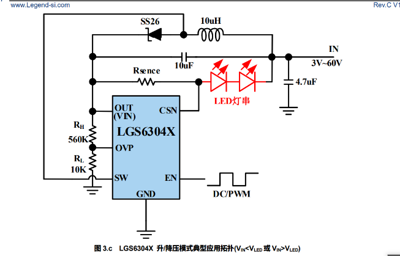
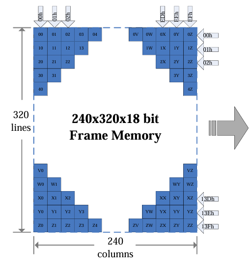

# MCU使用的外设FSMC（灵活静态存储控制器，Flexible Static Memory Controller）

##  FSMC 的作用

FSMC 可以把外部 LCD 显存映射到 MCU 的地址空间，实现高速并行读写。通过配置 FSMC，MCU 可以像访问内存一样访问 LCD

# 显示屏GC9307

GC9307 是一款常见的彩色 TFT LCD 屏驱动芯片，支持 8080 并口（MCU接口）通信。FSMC（灵活静态存储控制器，Flexible Static Memory Controller）是 STM32 等微控制器用来驱动外部并口设备（如 LCD、SRAM、NOR/NAND Flash）的硬件模块。

OLED(OrganicLight-Emitting Diode)：无背光层，厚度仅0.1-1毫米，支持‌折叠/曲面屏
LCD(Liquid Crystal Display)：需背光模组，厚度3-5毫米，无法弯曲。‌‌

## 原理简述

GC9307 通信方式
GC9307 支持 8/16 位 8080 并口，典型信号有：CS（片选）、RS（数据/命令）、WR（写）、RD（读）、D0~D7（数据线）。
。

### 硬件连接

- FSMC 的数据线（如 FSMC_D0D7）连接到 GC9307 的 D0-D7
- FSMC 的控制线（如 NOE, NWE, NE1）分别连接到 GC9307 的 RD, WR, CS
- RS（数据/命令选择）通常由 MCU 的一个 GPIO 控制

## 库lvgl介绍

lvgl 通常指的是 LittlevGL（现称 LVGL，Light and Versatile(多用途的) Graphics Library），是一个开源的嵌入式图形界面库，广泛用于MCU等资源受限设备上的GUI开发。它支持丰富的控件、动画、主题和多种显示驱动，适合制作触摸屏、仪表、家电等嵌入式设备的界面

# 原理简述

分辨率 240×320，像素格式为 18-bit RGB,（即 RGB666：每色 6 位）
 GRAM（图形随机存取存储器）是面板/控制器内部的像素缓存（通常是易失性 SRAM），MCU 把像素写入 GRAM 后面板直接从 GRAM 驱动显示，MCU 不必持续刷新每个像素。

column pointer is 0000h to 00EFh (239) 横
page pointer is 0000h to 013Fh  (319) 竖
左上角(0,0)

## 命令

 Memory Access Control 0x36

位 (Bit) 名称 值 作用说明
D7 MY 0 Row Address Order: 0 表示从上到下。
D6 MX 1 Column Address Order: 1 表示 左右镜像翻转（从右到左）。
D5 MV 0 Row/Column Exchange: 0 表示 保持竖屏逻辑（不做行列交换）。
D4 ML 0 Vertical Refresh Order: 0 表示从上到下刷新。
D3 BGR 1 RGB/BGR Order: 1 表示 BGR 颜色顺序（通常用于多数显示面板）。
D2 MH 0 Horizontal Refresh Order: 0 表示从左到右刷新。
D1 - 0 保留。
D0 - 0 保留。
