# GTB Develop GUIDE

## 1. The PID and UID need to be specified to connect
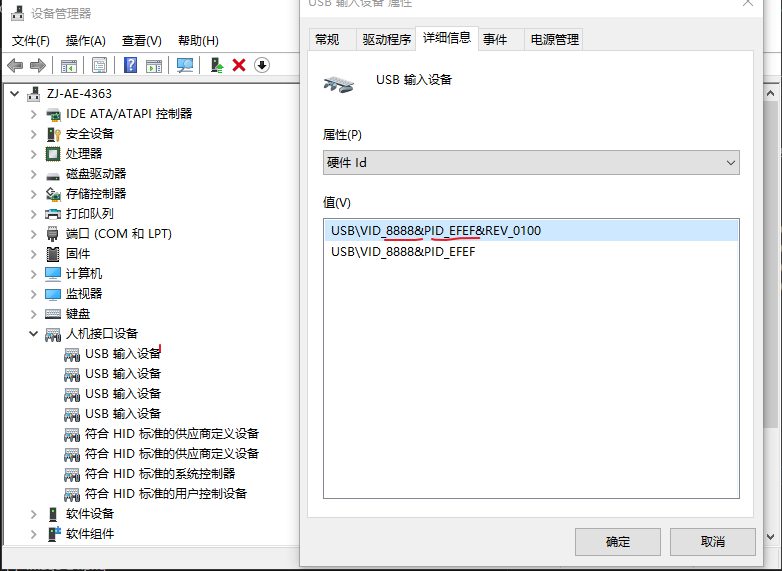

## 2. Transplant from User\thread\src\server_gtb.c
### 2.1 GC4.0 Lcd_AE_Test_Board fw USB communication function
GC4.0底板
USB send 
HOST to DEVICE
USBD_HID0_SetReport

USB receive
DEVICE_TO_HOST
USBD_HID_GetReportTrigger

## 3. GC7272不同状态下电压电流
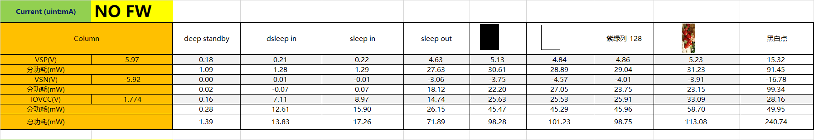 

## 4. GTB 报点 config

## GTB version
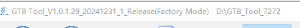
### 1.初始化代码
Notes\GTB\7272+BOE_longV验证代码20230413_70M_4.0.zip
### 2. BIN
Notes\GTB\GC7272.bin
### 3. 电压电流
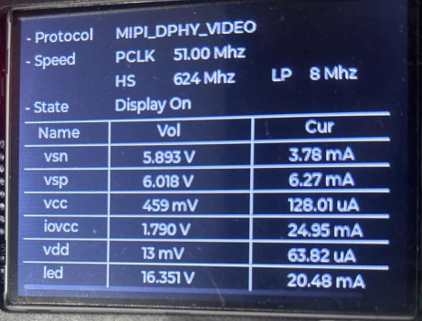
### 4. 屏
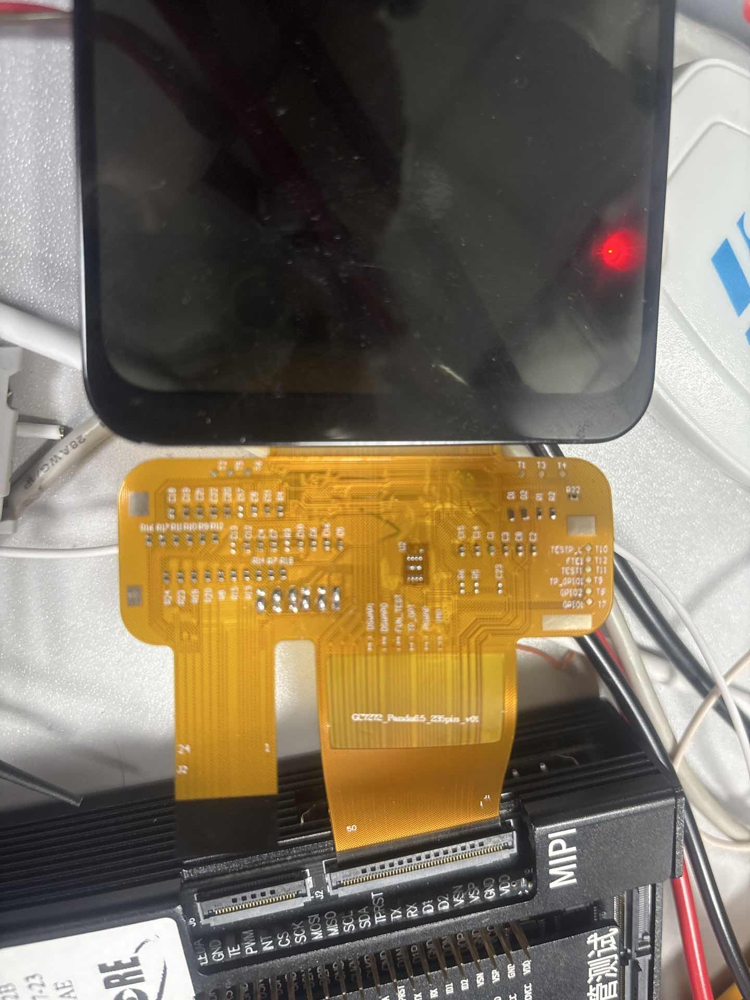
### 5. 底板固件
Notes\GTB\AE_Tool_Firmware_0538090A.bin
### 6. step1
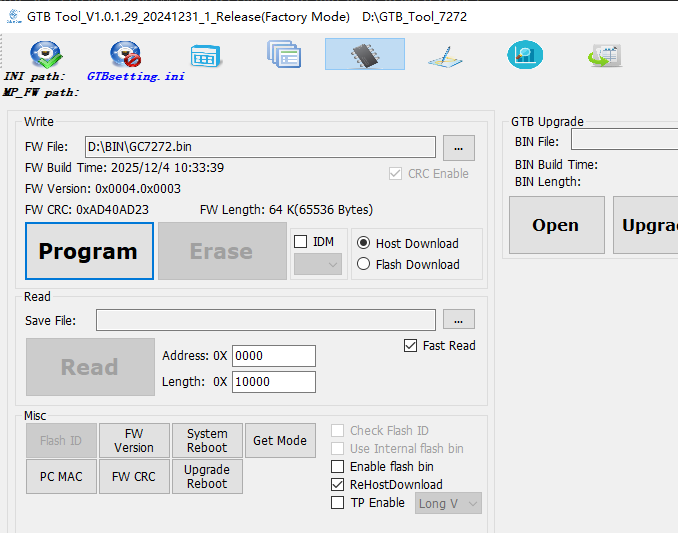
### 7. step2 按waitkey 屏幕亮
### 8. step3 报点
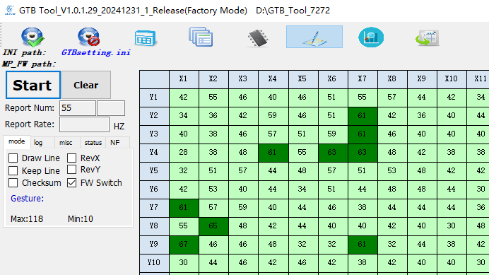

## 5. 日月同芯3#(铁哥给的屏幕(7272报点))

### 1. GC4.0上位机配置
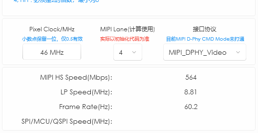
#### 1.1 initial code
D:\Notes\GTB\for_GC7272_NSBIN
#### 1.3 bin
D:\Notes\GTB\GC7272_NS.bin

### 2. 启动和报点前电压电流
见
<video controls src="pics/GTB/iwEcAqNtcDQDAQQABQAGsG68w1ncKhfSCR173yNBAwAH0iinXrsIAAmiaW0KAAvSAATTKw.mp4" title="Title"></video> 
<video controls src="pics/GTB/iwEcAqNtcDQDAQQABQAGsKwDE0bO1TkhCR174ZKbLwAH0iinXrsIAAmiaW0KAAvSAAoauQ.mp4" title="Title"></video>
 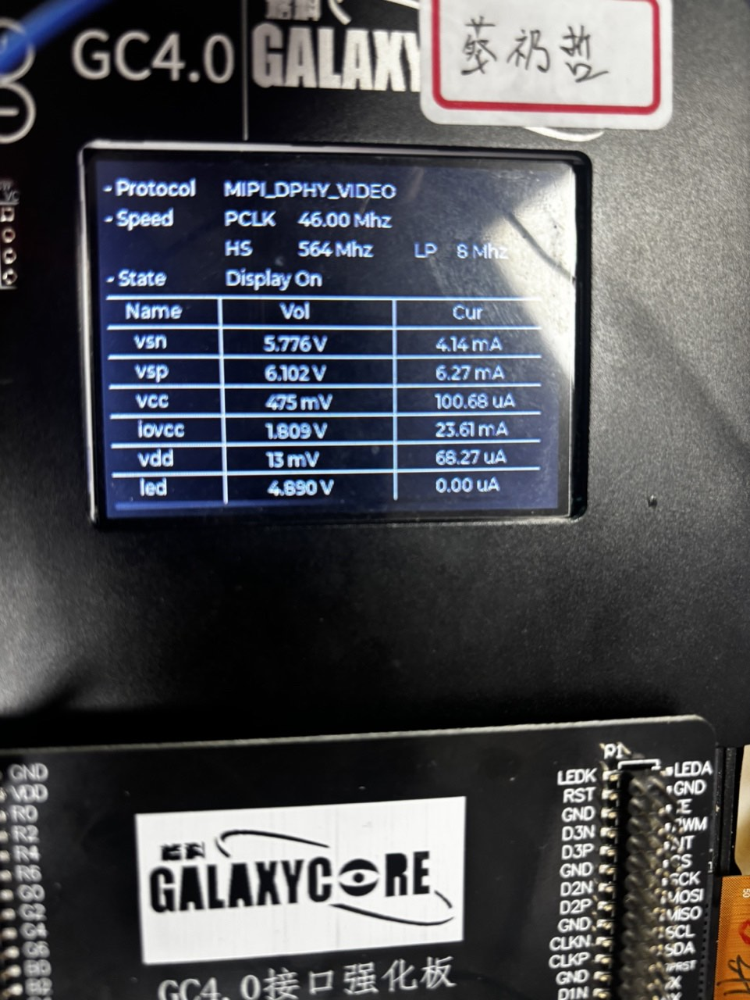 
 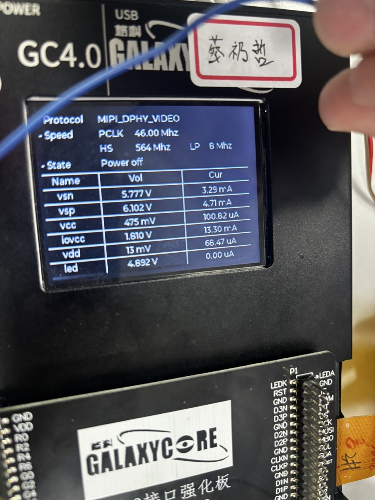

### 6. attention
1. 增大 底板参数USBD_HID0_EP_INT_OUT_BINTERVAL,
如改为 10,可以稳定program
2. 修改SPI分频 84M/256 ,烧录和报点比较稳定

## 通过GTB板进行SPI烧录3101COB
### 3101 电压电流IC状态对照表
sleep in ， sleepout ，dispon
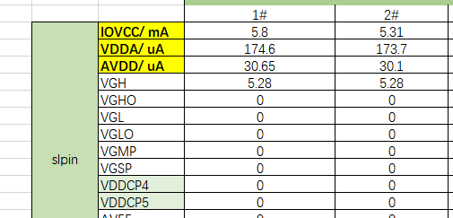
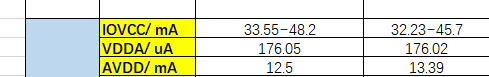
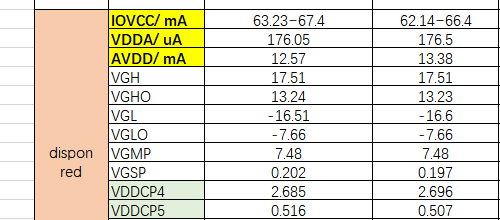
### 环境
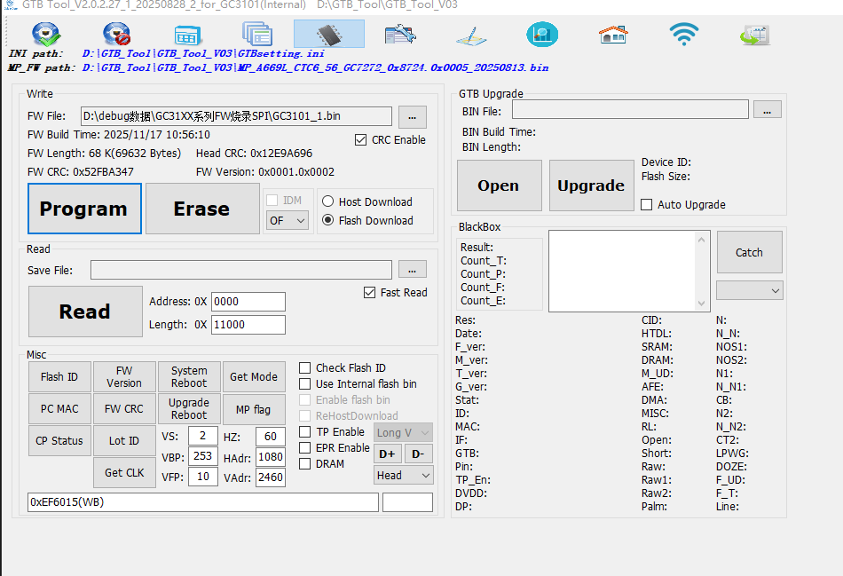
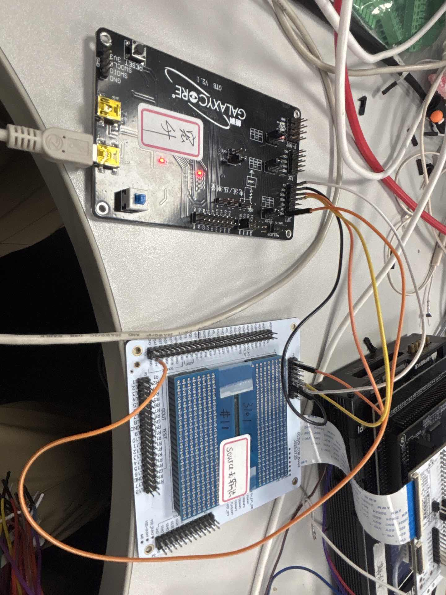
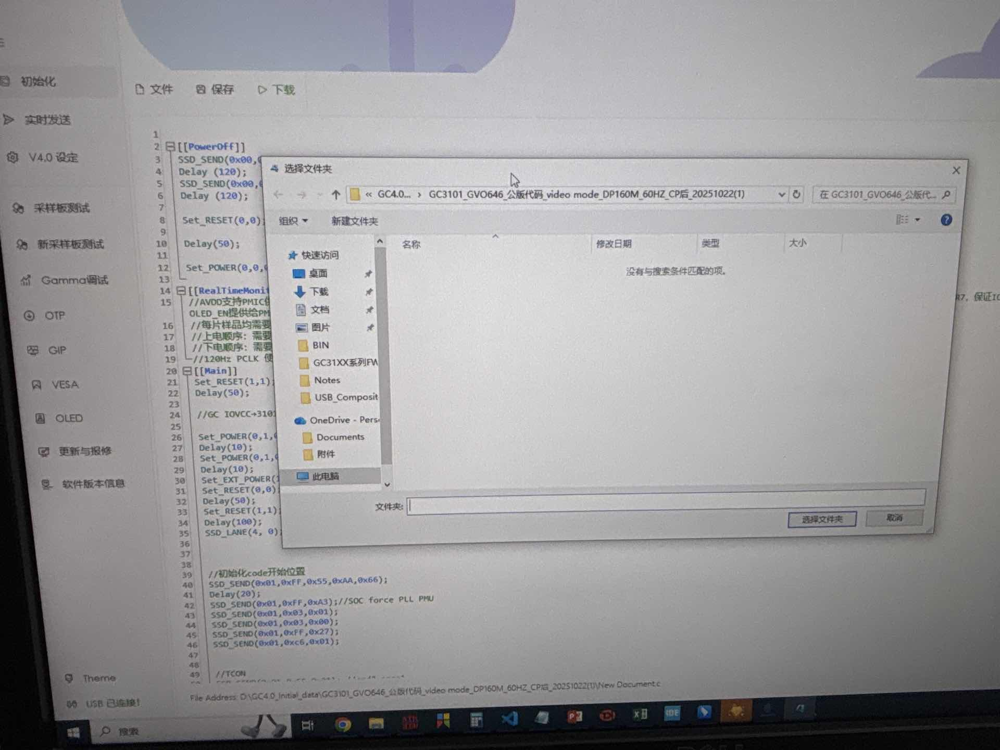
.

### 通过蓝板子烧
注意INT线要连
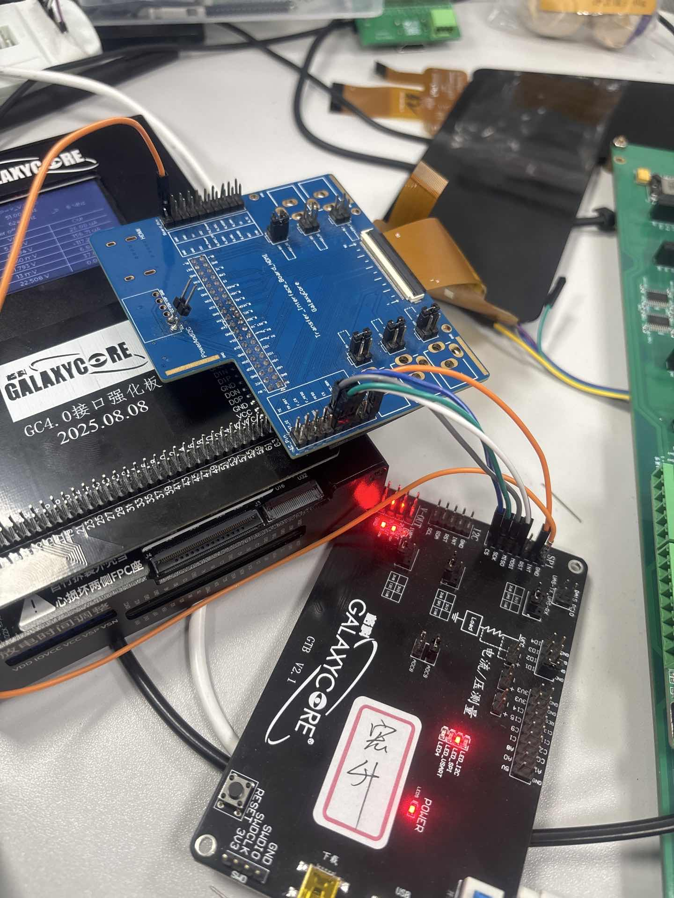
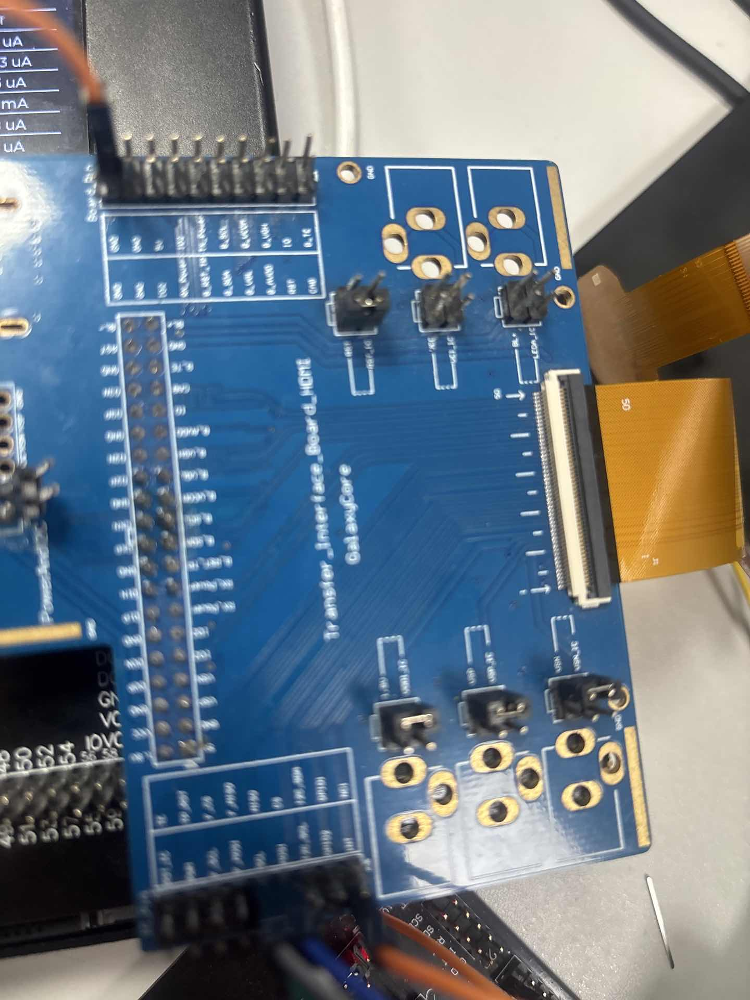
## STM32作为下位机

## RA增强板供电和烧录,GC4.0下初始化代码, 
### 电压电流
VSP=6.37,VSN=-5.86,IOVCC=1.8
### GC4.0下载初始化代码
GC V4.0 RA 1.0.0.6连接上GC4.0后初始化下载D:\GC4.0_Initial_data\7272+BOE_longV验证代码20230413_70M_4

### 示波器确定接口无杂波

### 遇到的问题
1   USB通信延迟大,排查出包长配置错误
2   levelshift损坏毛刺大,已更换板子
3   屏幕损坏后更换
4   piexel clock配置正确后解决了报点不稳定问题
5   裸机代码里有OSDelay
6   烧录慢原因是其他线程里有屏蔽中断的操作
7   