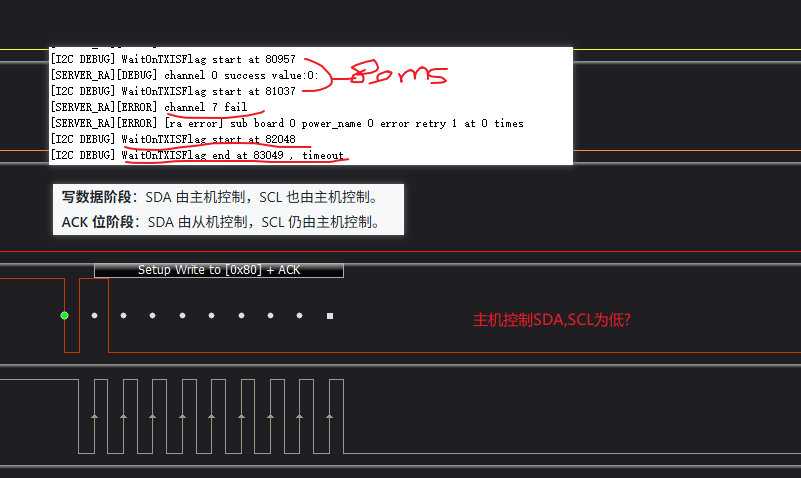
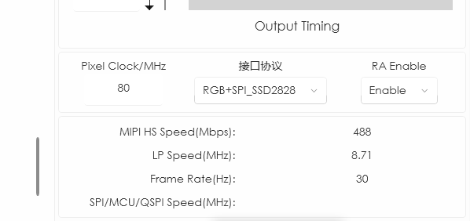
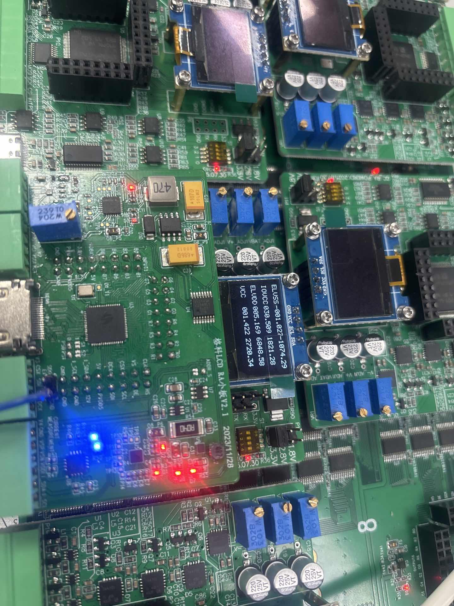
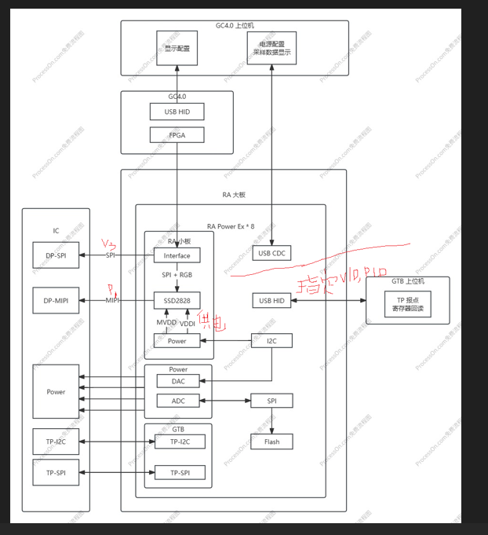

## 注释
RA_PowerEX板 TPS5430DDAR降压型DC-DC转换器注释说明

## 验证任务
1、电压设定和电压电流采样测试
step1：
Vi 统一设置为1500mv进行采样。采样值如下

channel 0 raw data 0.002581     AD_I_IOVCC
channel 1 raw data 0.002452     AD_I_VCC  
channel 2 raw data 0.002308     AD_I_ELVDD    
channel 3 raw data -0.000051     AD_I_ELVSS    
channel 4 raw data 3.295231     AD_V_ELVSS  3.29*2.5=8.225
channel 5 raw data 2.757151     AD_V_VCC    2736 
channel 6 raw data 2.978232     AD_I_ELVDD 2.97*2.5=7.425
channel 7 raw data 2.773812     AD_I_IOVCC  2736

step2：

代入vi=1500，
IOVCC+=5100-1.576Vi=2736
VCC+=5100-1.576Vi=2736

ELVDD+=12850-3.557Vi=7525
ELVSS-=-(12850-3.557Vi)=-7525

2、TSPI测试

目前只测试IO通断

GC4.0 初始化打开D:\Project\GC7274Panda，下载
打开D:\GTB\GTB_Tool.exe，勾选烧录IDM,D:\Project\GTB\TDDI_7272.bin，line 点start 2次

3、USB验证

新建CUBEIDE工程

4、屏幕
HS96L03W2C03

https://blog.csdn.net/LYH6767/article/details/126032948

4针0.96寸OLED
类型：0.96寸 OLED 显示屏
分辨率：通常为 128×64 像素
接口：I2C（常用地址 0x78）、4针
驱动芯片：一般为 SSD1306 或兼容芯片
应用：适用于嵌入式显示、STM32开发板等

User\bsp\src\bsp_gtb.c

spi i2c 收发

User\thread\src\server_gtb.c
VID,PID修改
USB通信

## GTB Tool与RA板通信

### GTB Tool_V2.0.2.25_20241121_1_for_GC3101 通过usb连接RA板，
RA板 CHID模式，VID和PID配置为
#define USBD_LANGID_STRING     1033
#define USBD_PID_HS     0xEFEF

## 测试环境
RADB （spi+rgb口） 连 底板左上RGB口
RAXB HDMI 连 测试板HDMI

GC V4.0 RA 1.0.0.6连接上GC4.0后初始化下载D:\GC4.0_Initial_data\GC3101_GVO646_公版代码_video mode_20250911(1)(2),在Video_START();后加命令SET_AVDD_ON(0);
接口协议：

测试板四个pin连接增强板
VDDI(HOLD)（iovcc3）1.8，VDDA（VCC2）2.7，AVDD（elvdd4）7,avss-GND

GC4.0 Rx引脚拉低 增强板检测到RST引脚（直连）拉低，给出AVDD7V、
User/ra/src/mipi_ra_ops drv_ra_power_on_all_sub_board
### 现象

### 结构框图

### 
drv_ra_device.c 驱动移植
一组读负压，一组读正压
 xb原理图上 2 power ， 3 power