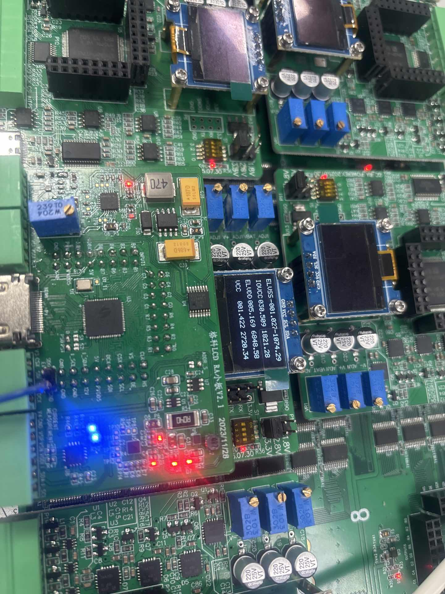
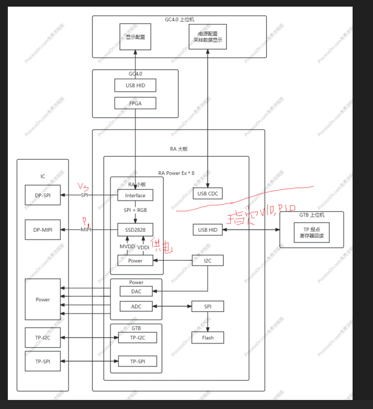
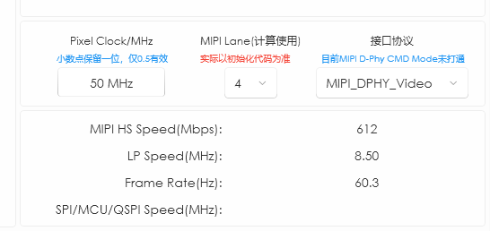
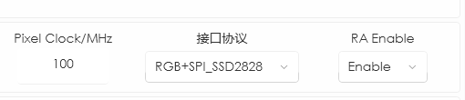

## 注释
RA_PowerEX板 TPS5430DDAR降压型DC-DC转换器注释说明

## 屏幕
HS96L03W2C03

https://blog.csdn.net/LYH6767/article/details/126032948

4针0.96寸OLED
类型：0.96寸 OLED 显示屏
分辨率：通常为 128×64 像素
接口：I2C（常用地址 0x78）、4针
驱动芯片：一般为 SSD1306 或兼容芯片
应用：适用于嵌入式显示、STM32开发板等

## GTB Tool与RA板通信

### GTB Tool_V2.0.2.25_20241121_1_for_GC3101 通过usb连接RA板，
RA板 CHID模式，VID和PID配置为
#define USBD_LANGID_STRING     1033
#define USBD_PID_HS     0xEFEF

## 测试环境
RADB （spi+rgb口） 连 底板左上RGB口
RAXB HDMI 连 测试板HDMI

GC V4.0 RA 1.0.0.6连接上GC4.0后初始化下载D:\GC4.0_Initial_data\GC3101_GVO646_公版代码_video mode_20250911(1)(2),在Video_START();后加命令SET_AVDD_ON(0);

接口协议：

测试板四个pin连接增强板
VDDI(HOLD)（iovcc3）1.8，VDDA（VCC2）2.7，AVDD（elvdd4）7,avss-GND

XB电源 MVDD,VDDIO

GC4.0 Rx引脚拉低 增强板检测到RST引脚（直连）拉低，给出AVDD7V、
User/ra/src/mipi_ra_ops drv_ra_power_on_all_sub_board
### 现象

### 结构框图

 ## 7275点亮
 ### 初始化代码
 D:\GC4.0_Initial_data\GC7275+BOE6.56IPS Video 60Hz 4.0
### GC4.0

### RA
