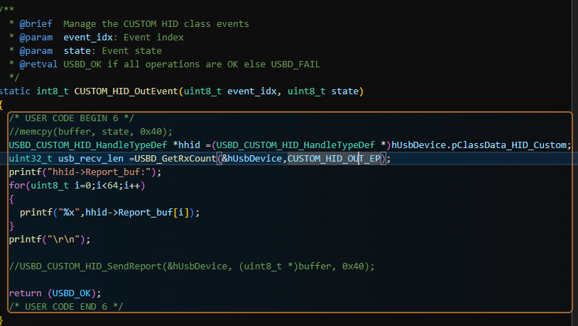

CUSTOM_HID_OutEvent
# 1、USB有4个中断如下

  OTG_HS_EP1_OUT_IRQn         = 74,     /*!< USB OTG HS End Point 1 Out global interrupt                       */
  OTG_HS_EP1_IN_IRQn          = 75,     /*!< USB OTG HS End Point 1 In global interrupt                        */
  OTG_HS_WKUP_IRQn            = 76,     /*!< USB OTG HS Wakeup through EXTI interrupt                          */
  OTG_HS_IRQn 

USB OTG HS 有一个全局中断（OTG_HS_IRQn），用于处理大部分事件，包括其他端点的中断。
端点 1（EP1）的 IN 和 OUT 方向被赋予了单独的中断向量（OTG_HS_EP1_OUT_IRQn = 74 和 OTG_HS_EP1_IN_IRQn = 75），这是因为 EP1 通常是第一个数据端点（端点 0 专用于控制传输），并且在许多应用中被频繁使用（如批量传输）。
# 2、OTG_HS_IRQn这个中断最后会调用CUSTOM_HID_OutEvent这个函数，可以在这里取出buf

复合设备中
协议栈句柄（hUsbDevice）的classdata绑定了
实例句柄（hUsbDevice.pClassData_HID_Custom）