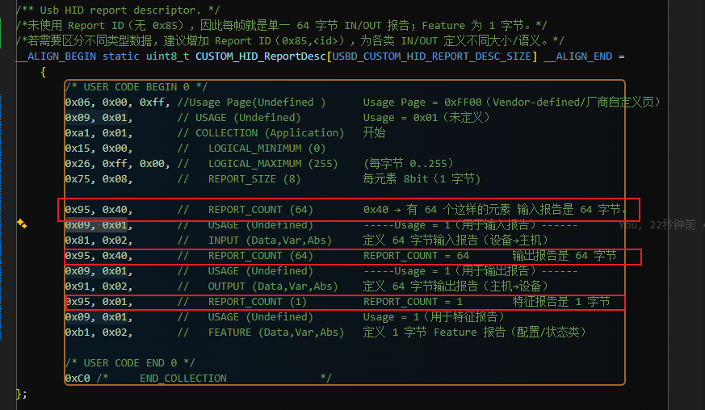

## 1 /* USB CUSTOM_HID device FS Configuration Descriptor */
#define CUSTOM_HID_EPIN_SIZE                         0x40U
#define CUSTOM_HID_EPOUT_SIZE                        0x40U
#define CUSTOM_HID_FS_BINTERVAL                      0x02U      /*对 IN 端明确有效；OUT 端常被主机忽略*/
## 2 Usb HID report descriptor
