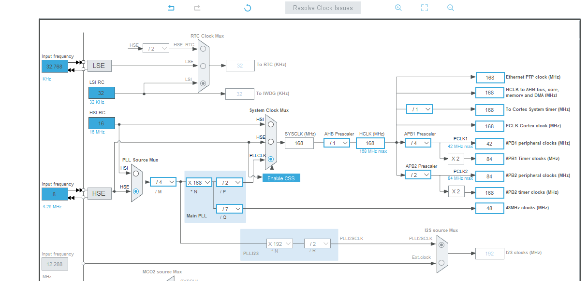
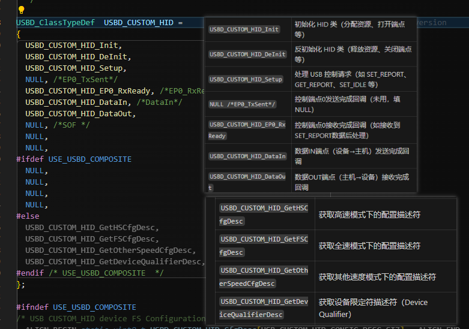
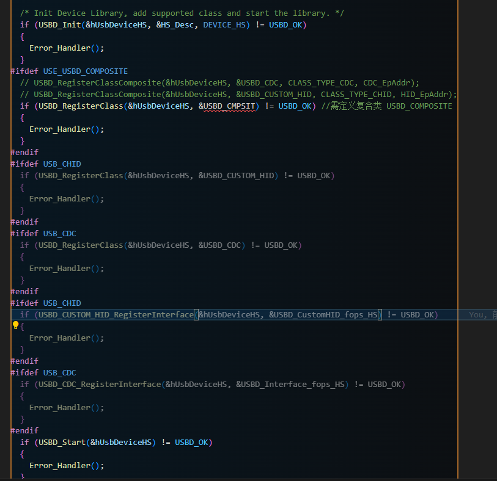
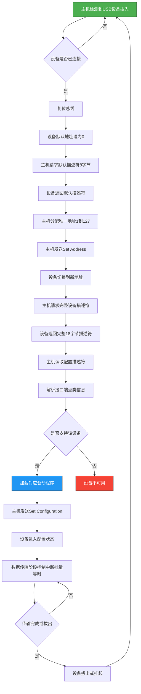

# I-CUBE-USBD-Composite
A wrapper class around ST USB stack to create STM32 USB Composite devices with ease.
## Modifications
* CDC supports multiple instance
* Removed ST use of malloc
* UAC Microphone & Speaker separated
* HID Keyboard & Mouse separated

## TODO
* Add CubeMX Templates
* Fix UAC combination with other classes

## How to use
### 1. Download AL94.I-CUBE-USBD-COMPOSITE.1.0.0.pack from repo.


### 2. Add AL94.I-CUBE-USBD-COMPOSITE.1.0.0.pack to CubeMX.


### 3. Inlude in project
Enable USB peripheral & NVIC


Add middleware to project


Add components to project, Selection of Core & COMPOSITE is must


Enable the classes you want


Dont forget!!!


### 4. Generate Code
Call MX_USB_DEVICE_Init(); manually


## Enumerated
### 1. USB CDC ACM.


### 2. CDC & HID.


### 3. RNDIS.


### 4. UAC Microphone & Speaker.


### 5. UVC Camera & Mass Storage.


# Troubleshooting
1. Cross check number of endpoints in MCU & consumed by application.
2. Adjust Endpont Size & PMA buffers in "Target/usbd_conf.c" accordingly.
3. For some classes "SOF" must be enabled!!!
4. Make sure MCU clock is configured properly & USB Interrupt is enabled.
5. For L5 HAL_PWREx_EnableVddUSB() needs to be called before enabling USB operation.


# STM32 USB虚拟串口（CDC VCP）教程

---

## 一、STM32硬件与USB接口基础

- STM32系列MCU的USB分为三种：
  - **USB_FS（全速，Full Speed）**：只需连接 DM/D- 和 DP/D+ 两个引脚。
  - **USB_OTG_FS（全速OTG）**：既可作为Device，也可作为Host。
  - **USB_OTG_HS（高速OTG）**：大多数型号需外接PHY芯片（如USB3300），至少12个引脚。只有STM32F723内置HS PHY，无需外接。
- **时钟要求**：USB对时钟精度要求高，建议使用外部无源晶体或有源晶振，USB_FS总线时钟一般为48MHz。

## Host 
USB是由Host端控制整个总线的数据传输的。单个USB总线上，只能有一个Host。 
## OTG 
On The Go，这是在USB2.0引入的一种mode，提出了一个新的概念叫主机协商协议（Host Negotiation Protocol），允许两个设备间商量谁去当Host
USB_ID:输入信号,由 USB OTG 协议定义,用于识别 USB 口所接设备的默认角色(host or device)。USB_ID 默认上拉,处于 device 状况,如果要控制器进入 host 状态,需外接 mini-A 口或 micro-A 口将 USB_ID 短接到地。


## 二、STM32 USB CDC VCP配置流程

###  CubeMX时钟配置

- 选择外部晶振，USB时钟设为48MHz。

### 启用USB接口

- 选择USB_OTG_FS或USB_FS，模式设为Device_Only。

###  使用USB设备库

- 中间件启用USB_DEVICE库，Class选择CDC（虚拟串口）。

###  参数设置

- 设备接口数量、电源、收发缓存等参数一般默认即可。

###  设备描述配置

- **VID（厂商ID）**：可在 [USB.org Developers](https://www.usb.org/) 查询，如1155为STMicroelectronics，也可用单位自有编码。
- **PID（产品ID）**：可自定义，描述字符串也可自定义。

###  代码生成与下载

- 按上述方式配置，生成代码并编译下载到开发板。

###  驱动安装

- Win10及新Linux系统免驱。
- 低版本Windows需安装官方驱动：[STSW-STM32102](https://www.st.com/en/development-tools/stsw-stm32102.html)。

---

## 三、USB硬件连接注意事项

- 确认D+/D-引脚连接的是FS的引脚，避免接到HS外设引脚导致无法通讯。
- 若接到HS引脚但只用FS功能，可将HS配置为FS使用。

---

## 四、STM32 USB回环测试实现

在 `usbd_cdc_if.c` 文件的 `CDC_Receive_FS` 函数中添加一行代码，实现回环：

```c
CDC_Transmit_FS(Buf, *Len); // 回环发送收到的数据
```

- 测试时，上位机发送任何数据，STM32都会原样返回。
- 波特率设置对USB虚拟串口无影响，实际数据传输由USB协议控制。

---

## 五、USB包大小与数据收发逻辑

- USB_FS端点包大小默认64字节，发送/接收超过64字节需分包处理。
- 若一次发送大于64字节，设备端会分多次接收，每次最多64字节。
- 若连续调用 `CDC_Transmit_FS`，前一次发送未完成，后一次调用会失败。

### 建议：

- 接收时用特殊字符或超时判断一帧数据结束。
- 发送时可批量发送，全部发送完成后会触发 `CDC_TransmitCplt_FS` 回调。

---

## 六、常用USB CDC相关函数

- `CDC_Control_FS()`：主机请求回调
- `CDC_Receive_FS()`：接收数据回调
- `CDC_Transmit_FS()`：发送数据
- `CDC_TransmitCplt_FS()`：发送完成回调
---


# STM32 USB CHID教程

###  1、CubeMX时钟配置

- 选择外部晶振，USB时钟设为48MHz。

### 2、启用USB接口

- 选择USB_OTG_FS或USB_FS，模式设为Device_Only。

###  3、使用USB设备库

- 中间件启用USB_DEVICE库，Class选择CHID。
- 总线供电（Bus‑powered / 从总线供电）：设备(整块板子)完全依赖 USB 主机 / 集线器的 VBUS 提供电源。配置描述符的 bmAttributes 中“Self‑Powered”位为 0，bMaxPower 表示设备从 USB 申请的最大电流（单位：2 mA，例如 bMaxPower=50 → 100 mA）。从总线供电设备不能向 VBUS 回馈（需防止反灌）。
- 外部供电（Self‑powered / 自供电）：设备(整块板子)由外部电源（适配器、电池或板上电源）供电。描述符中将 Self‑Powered 位设 1，bMaxPower 仍可填写主机所需的最大电流（若需主机少量供电）。自供电设备必须正确处理 VBUS 检测、可以在不依赖 VBUS 时工作，但仍应检测 VBUS 以响应总线状态（枚举、悬挂等）。

### 4、如何设置报告描述符

#### 4.1 利用HID descriptor Tool软件生成发送接收报文描述符数据

```c
HID Report 大小（由 REPORT_COUNT×REPORT_SIZE 决定）：设备按这个“报文”长度组织一次上报/下发数据。
主机侧的一次 read/一次 USB 事务，通常对应一个 report（或一个端点包 chunk）。

📝usbd_custom_hid_if.c
__ALIGN_BEGIN static uint8_t CUSTOM_HID_ReportDesc_HS[USBD_CUSTOM_HID_REPORT_DESC_SIZE] __ALIGN_END =
{
		  /* USER CODE BEGIN 0 */
		    0x05, 0x8c, // 表示使用的用途页（Usage Page）。
        //0x8C 在这里是厂商/芯片厂指定的页面（ST 的自定义页），告诉主机这是厂商定义的用途集合。
		    0x09, 0x01, // 该 Usage Page 下的用途 ID = 1，表示整个设备或应用的用途（比如“Demo Kit”）
		  0xa1, 0x01, // COLLECTION (Application) /
        //开始一个 Application 集合，表示一个完整的设备/功能块。
        //**************************************************************************
		    // The Input report 设备向主机发送
		    0x09,0x03, // 用于下面的 Input 报告（厂商自定义用途 ID = 3）
		    0x15,0x00, // 报文字段的最小逻辑值 0
		    0x26,0x00, 0xFF, //  最大逻辑值 255（0xFF），这里用 16 位的形式指定 0x00FF
		    0x75,0x08, //表示每个字段的位宽为 8 位:REPORT_SIZE
		    0x95,CUSTOM_HID_EPIN_SIZE, //表示报告里有多少个字段:REPORT_COUNT
        //总字节 =REPORT_COUNT /× (REPORT_SIZE/8)
        //上位机每次读到的是单个短 report
		    0x81,0x02, // INPUT (Data,Var,Abs) 待分析,0x81（INPUT）表示设备向主机发送
        //（IN endpoint / interrupt IN）。主机通过轮询 IN 端点或 HID API 读取到这些字节。
		    //**************************************************************************
		    // The Output report 主机向设备发送
		    0x09,0x04, // USAGE ID - 用于下面的 Output 报告（厂商自定义用途 ID = 4）
		    0x15,0x00, // LOGICAL_MINIMUM (0)
		    0x26,0x00,0xFF, // LOGICAL_MAXIMUM (255)
		    0x75,0x08, // REPORT_SIZE (8)
		    0x95,CUSTOM_HID_EPOUT_SIZE, //REPORT_COUNT
		    0x91,0x02, // OUTPUT (Data,Var,Abs)
		    //32
		  /* USER CODE END 0 */
		  0xC0    /*     END_COLLECTION	        — 结束集合      */
};

0x85, 0x01, // Report ID 1 其中 0x85 是 Report ID 的标签，0x01 是实际的 ID 值
Report ID 是 USB HID 协议中的“报告标识符”，用于区分不同类型的数据报告（Report），让主机和设备能够识别和处理多种数据格式。


```
#### 4.2 配置端点地址
高位（bit7）表示方向，低 4 位（bit0~bit3）表示端点号（需唯一）
eg.0x81 indicate endpoint num 1 and direction in.0x02 represent endpoint num 2 and direction out 
🌟CUSTOM_HID_EPIN_SIZE
代表输入端点的数据包大小（单位：字节），如 0x02U 表示每次最多发送 2 字节。


#### 4.2在usbd_conf.h中修改发送数据长度和报文长度

```c
📝usbd_conf.h
#define USBD_CUSTOMHID_OUTREPORT_BUF_SIZE 64U  //固件内部缓冲区（主机→设备的 Output 报告缓冲区）
/---------- -----------/
#define USBD_CUSTOM_HID_REPORT_DESC_SIZE 33U   //报文描述符（Report Descriptor）长度
/---------- -----------/
#define CUSTOM_HID_HS_BINTERVAL 0x1U
//在 Full-Speed (FS)：bInterval 直接表示以毫秒为单位的轮询间隔（1 = 1 ms）。
//在 High-Speed (HS)：bInterval 是以 2^(bInterval-1) 个微帧（microframe，125 µs）为单位的指数值，
//bInterval=1 表示每 1 微帧（125 µs）轮询一次（最频繁），通常硬件/主机会有最低限制和调度约束。
```

#### 4.3 如何修改VID和PID

在usbd_desc.c中修改USB HID参数

```c
📝usbd_desc.c
#define USBD_VID     1155
#define USBD_LANGID_STRING     1033
#define USBD_MANUFACTURER_STRING     "STMicroelectronics"
#define USBD_PID_HS     22352
#define USBD_PRODUCT_STRING_HS     "STM32 Custom Human interface"
#define USBD_CONFIGURATION_STRING_HS     "Custom HID Config"
#define USBD_INTERFACE_STRING_HS     "Custom HID Interface"
```

### 5、参考链接
https://blog.csdn.net/iqiaoqiao/article/details/118874573


### 6、发送回调函数
📝usbd_custom_hid_if.c
USBD_HID0_SetReport 是 Keil MDK/ARM RL-USB 中的标准回调函数；
CUSTOM_HID_OutEvent_HS 是 STM32CubeIDE（STM32 USB Device Library）中自定义 HID 的回调函数

## 代码详解
### USB复合设备实现,CDC,CHID

#### 快速版
参考github.com/alambe94/I-CUBE-USBD-Composite生成工程
stm32f4xx_it.c添加中断回调函数void OTG_HS_IRQHandler(void)


usb_conf.h 定义#define USE_USBD_COMPOSITE


cdc工程从chid的工程中拷贝，仅拷贝usbd_customhid.h、usbd_customhid.c和应用代码uusbd_custom_hid_if.c、usbd_custom_hid_if.h
⚠️ ⚠️ ⚠️ ⚠️ ⚠️ ⚠️ ⚠️ ⚠️ ⚠️ ⚠️ ⚠️ ⚠️ usbd_conf.c要合并HID和CDC
```c
void *USBD_static_malloc(uint32_t size)
{
    static uint32_t mem_cdc[(sizeof(USBD_CDC_HandleTypeDef)/4)+1];      // CDC内存
    static uint32_t mem_hid[(sizeof(USBD_CUSTOM_HID_HandleTypeDef)/4)+1]; // HID内存

    if (size == sizeof(USBD_CDC_HandleTypeDef))
        return mem_cdc;
    else if (size == sizeof(USBD_CUSTOM_HID_HandleTypeDef))
        return mem_hid;
    else
        return NULL; // 其他类型返回NULL
}
```
⚠️ ⚠️ ⚠️ ⚠️ ⚠️ ⚠️ ⚠️ ⚠️ ⚠️ ⚠️ ⚠️ ⚠️
USBD_HS_DeviceDesc

解释
bDeviceClass = 0x02
表示该设备属于 Communications Device Class (CDC)，即通信设备类，常用于 USB 虚拟串口（CDC VCP）。

bDeviceSubClass = 0x02
表示该设备属于 CDC 的 Abstract Control Model (ACM) 子类，专用于虚拟串口（VCP）功能。

作用
这两个字段让主机识别你的设备是 CDC 类（虚拟串口），并加载对应驱动。
如果你做的是 CDC+HID 复合设备，通常设备类填 0x00（每个接口单独声明类），否则主机只识别为 CDC


#### 打开USE_USBD_COMPOSITE宏开关
📝在 usbd_conf.h 文件中添加：
#define USE_USBD_COMPOSITE
复合设备支持：当你启用复合设备（如同时支持 CDC、HID、MSC 等），每个 Class（类）都需要有自己的处理函数和描述符。这个数组就是用来存放这些 Class 的指针。
#### 注册多个复合设备


#### 报错少函数参数ClassId
注册顺序决定编号
当你用 USBD_RegisterClassComposite() 注册多个 Class 时，注册的顺序就是 ClassId 编号：
第一个注册的 Class，ClassId = 0
第二个注册的 Class，ClassId = 1
依此类推
#### usbd_composite_builder.c

新增的复合设备文件为：usbd_composite_builder.c usbd_composite_builder.h，这两个文件的路径如下，经供参考：C:\Users\A0004363\STM32Cube\Repository\STM32Cube_FW_F4_V1.28.3\Middlewares\ST\STM32_USB_Device_Library\Class

#### 激活相关 Class 宏定义
确保在 usbd_conf.h 或项目配置中打开相关宏，如：
#define USBD_CMPSIT_ACTIVATE_CDC      1
#define USBD_CMPSIT_ACTIVATE_CUSTOMHID 1
#define USBD_COMPOSITE_USE_IAD      1


####  详解STM32F407VET6 USB CDC配置
##### USB初始化(协议栈句柄,协议层描述符结构体,id)
1、绑定协议层描述符结构体和id(决定用哪个外设)到句柄

###### 协议层描述符结构体
成员名	作用说明
USBD_HS_DeviceDescriptor			获取设备描述符（Device Descriptor）主机识别设备类型
USBD_HS_LangIDStrDescriptor			获取语言ID字符串描述符（LangID String）
USBD_HS_ManufacturerStrDescriptor	获取厂商字符串描述符（Manufacturer String）
USBD_HS_ProductStrDescriptor		获取产品字符串描述符（Product String）
USBD_HS_SerialStrDescriptor			获取序列号字符串描述符（Serial String）
USBD_HS_ConfigStrDescriptor			获取配置字符串描述符（Configuration String）
USBD_HS_InterfaceStrDescriptor		获取接口字符串描述符（Interface String）
USBD_HS_USR_BOSDescriptor			获取 BOS 描述符（Binary Object Store），仅在启用 LPM 时有效

2、初始化PCD
- `PCD_HandleTypeDef` 负责**硬件层**，直接和 USB 控制器打交道。
- `USBD_HandleTypeDef` 负责**协议层**，管理 USB 设备的协议和功能。
- 两者通过 `pData` 成员互相保存对方指针，实现回调和数据交互。例如：
  - `PCD_HandleTypeDef.pData = USBD_HandleTypeDef`
  - `USBD_HandleTypeDef.pData = PCD_HandleTypeDef`

hpcd_USB_OTG_HS.Instance = USB_OTG_HS;
指定 USB OTG HS 外设的寄存器基地址。

hpcd_USB_OTG_HS.Init.dev_endpoints = 6;
设置设备端点数量为 6（包括控制端点和数据端点）。

hpcd_USB_OTG_HS.Init.speed = PCD_SPEED_FULL;
设置 USB 工作速度为全速（Full Speed），即 12Mbps。

hpcd_USB_OTG_HS.Init.dma_enable = DISABLE;
禁用 DMA 功能，数据传输不使用 DMA。

hpcd_USB_OTG_HS.Init.phy_itface = USB_OTG_EMBEDDED_PHY;
选择嵌入式 PHY（物理层），即使用芯片内部的 USB PHY。

hpcd_USB_OTG_HS.Init.Sof_enable = DISABLE;
禁用 SOF（Start Of Frame）信号中断。

hpcd_USB_OTG_HS.Init.low_power_enable = DISABLE;
禁用低功耗模式。

hpcd_USB_OTG_HS.Init.lpm_enable = DISABLE;
禁用 LPM（Link Power Management）功能。

hpcd_USB_OTG_HS.Init.vbus_sensing_enable = DISABLE;
禁用 VBUS 检测功能（不检测 USB 线上的电源电压）。

hpcd_USB_OTG_HS.Init.use_dedicated_ep1 = DISABLE;
禁用专用端点1（部分芯片支持端点1专用功能）。

hpcd_USB_OTG_HS.Init.use_external_vbus = DISABLE;
禁用外部 VBUS 检测（使用内部方式）。

```c
HAL_PCDEx_SetRxFiFo(&hpcd_USB_OTG_HS, 0x200);
```
- 设置**接收端点（Rx FIFO）**的缓冲区大小为 `0x200`（十六进制，等于 512 字节）。
- 所有 OUT 端点（主机→设备）共享这块缓冲区。

```c
HAL_PCDEx_SetTxFiFo(&hpcd_USB_OTG_HS, 0, 0x80);
```
- 设置**发送端点0（Tx FIFO）**的缓冲区大小为 `0x80`（128 字节）。
- 端点0通常是控制端点（EP0）。

```c
HAL_PCDEx_SetTxFiFo(&hpcd_USB_OTG_HS, 1, 0x174);
```
- 设置**发送端点1（Tx FIFO）**的缓冲区大小为 `0x174`（372 字节）。
- 端点1通常用于数据传输（如 CDC/HID）。

---

##### 注册类（设备协议栈句柄，CDC实例句柄）
将CDC实例绑定到设备协议栈
将CDC实例的配置描述符绑定到设备协议栈句柄
#### 注册接口（设备协议栈句柄，CDC接口函数实例句柄）
CDC接口函数实例绑定到设备协议栈句柄

组合设备的核心,pClassData和pUserData在USBD_HandleTypeDef中是指针形式，所以在调用不同类的时候，改变指针的指向，即可完成不同类的功能
