# GTB Develop GUIDE

### GTB_Tool.exe config
SW:D:\GTB
GC4.0: spi to IC
fw:2509251702

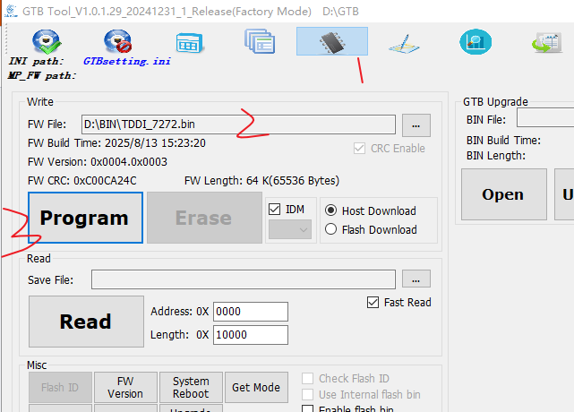
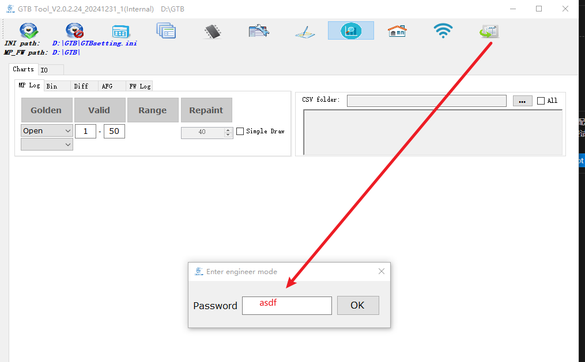
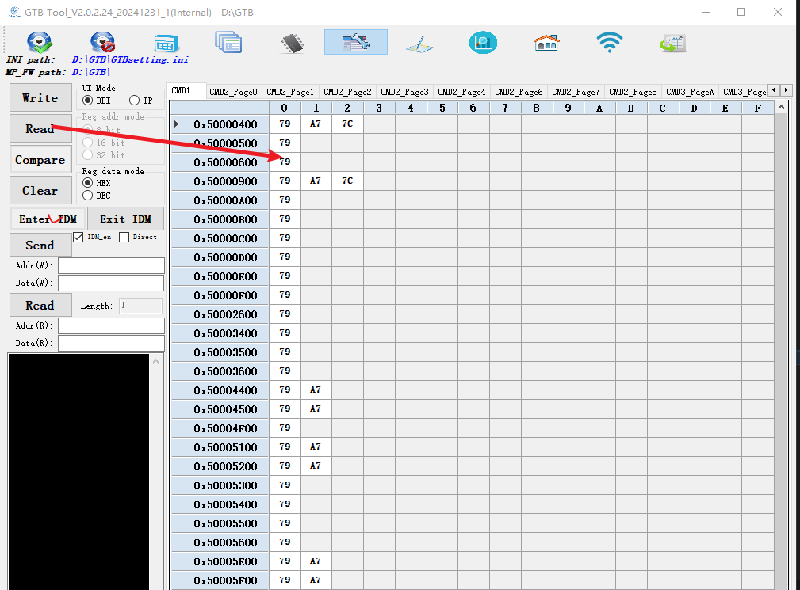
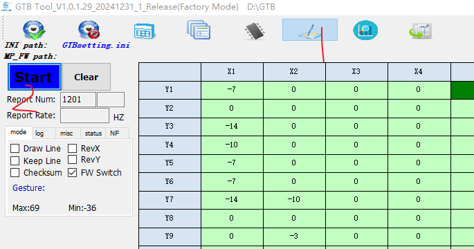

STM32 specifies UID and PID
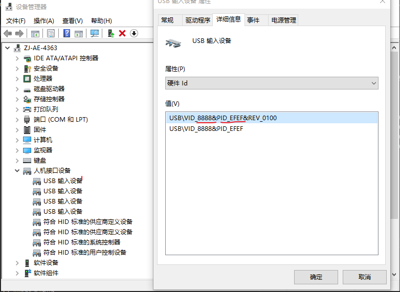

Transplant from User\thread\src\server_gtb.c

## 通过GTB板进行SPI烧录
### sleep in ， sleepout ，dispon
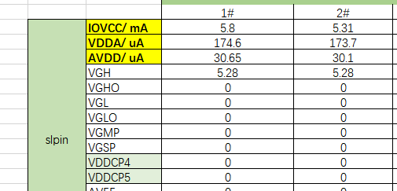
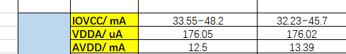
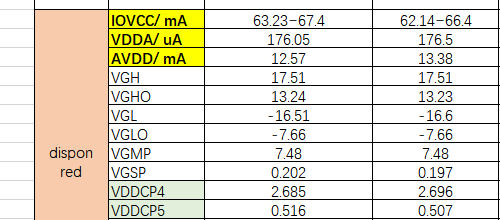
### 环境
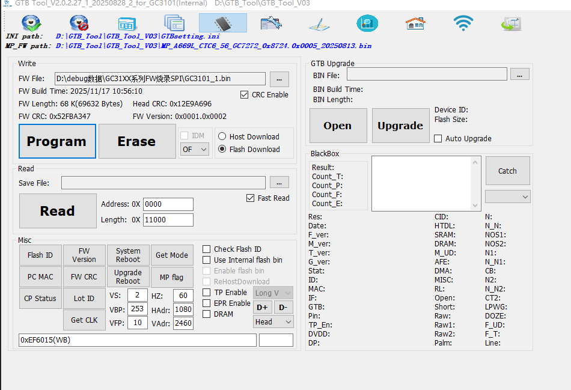
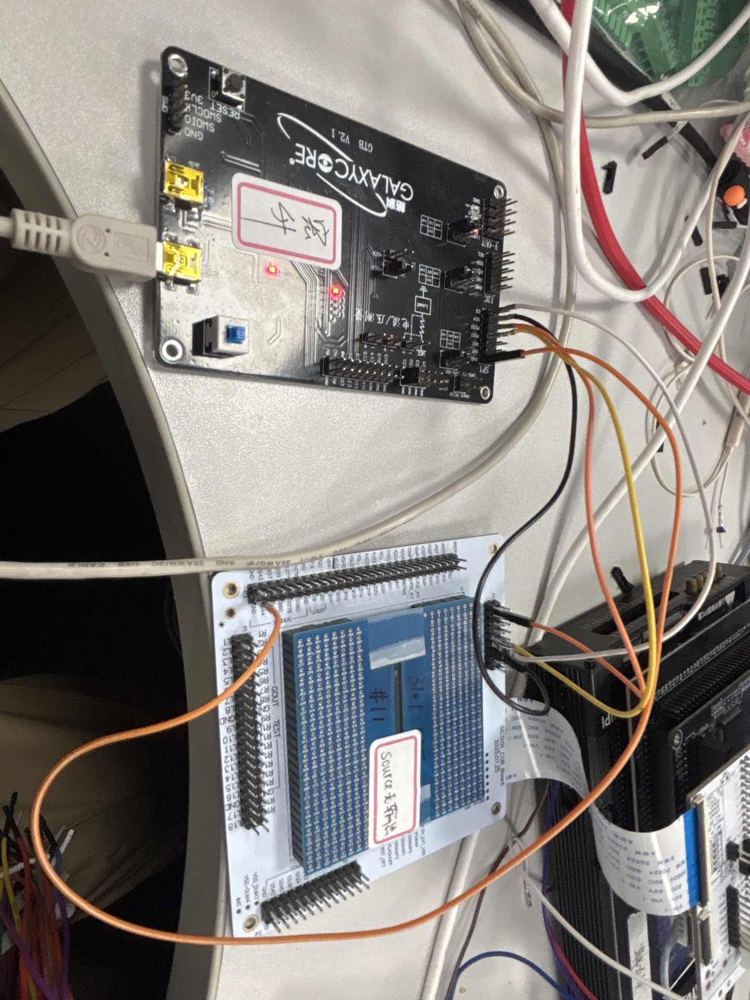
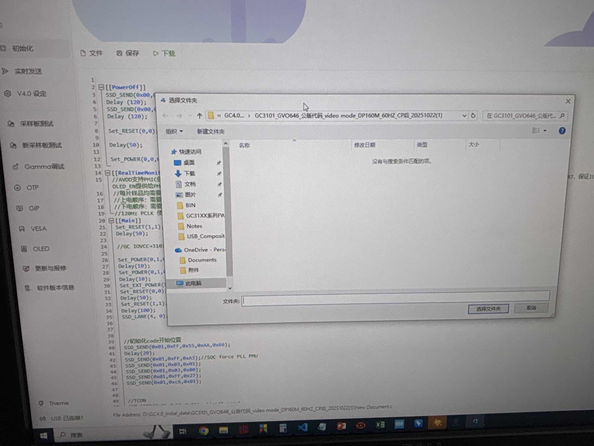
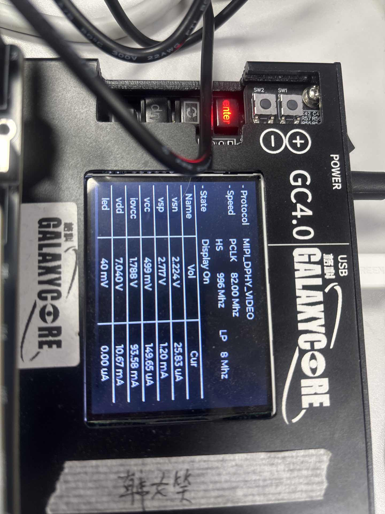