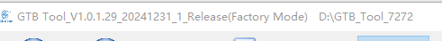
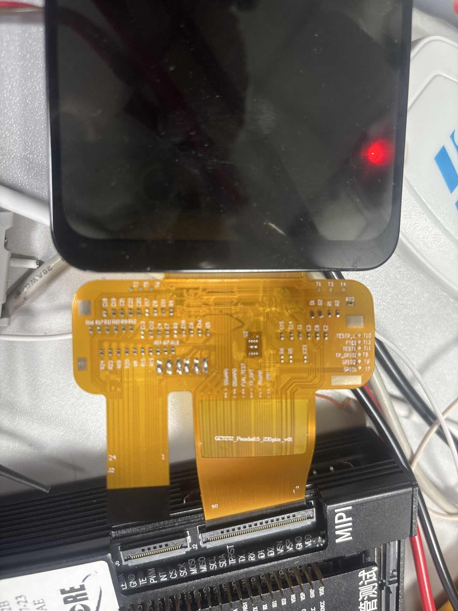
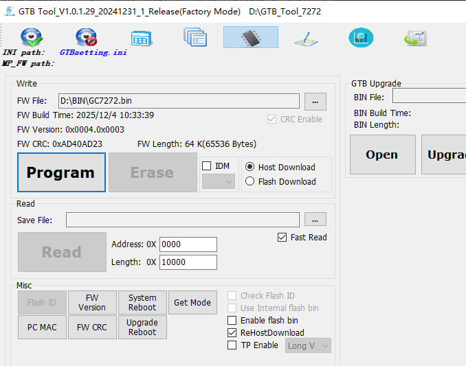
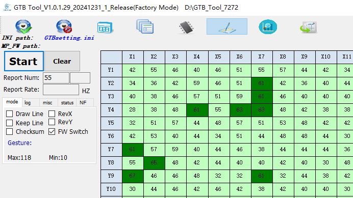

# GTB Develop GUIDE

## GTB 报点 config

### GTB version

### 初始化代码
Notes\GTB\7272+BOE_longV验证代码20230413_70M_4.0.zip
### BIN
Notes\GTB\GC7272.bin
### 屏

### 底板固件
Notes\GTB\AE_Tool_Firmware_0538090A.bin
### step
1、
2、按waitkey 屏幕亮
3、

## 通过GTB板进行SPI烧录
### sleep in ， sleepout ，dispon

### 环境

## STM32作为下位机

STM32 specifies UID and PID

Transplant from User\thread\src\server_gtb.c

GC4.0底板
HOST to DEVICE
USBD_HID0_SetReport

DEVICE_TO_HOST
USBD_HID_GetReportTrigger