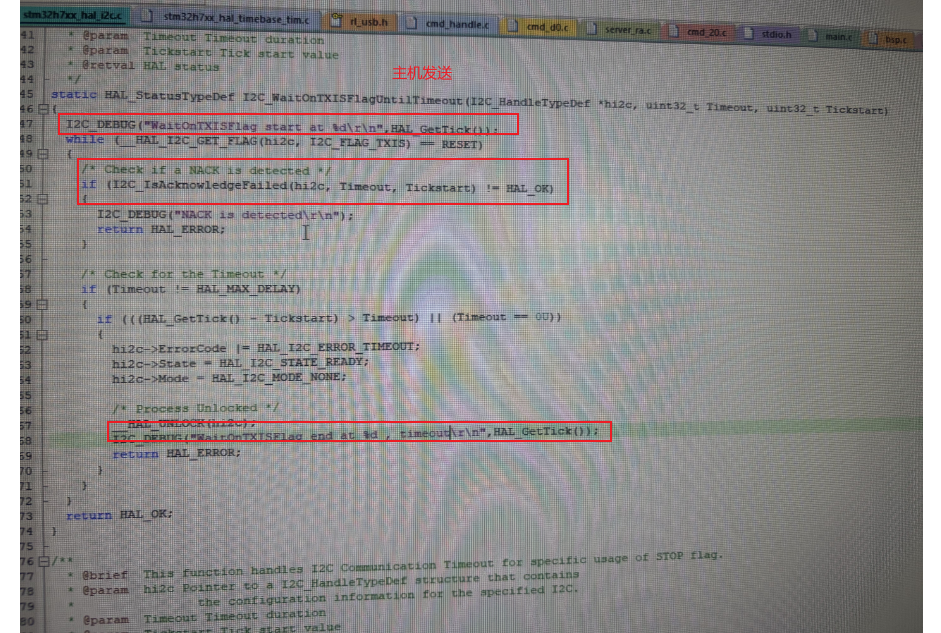
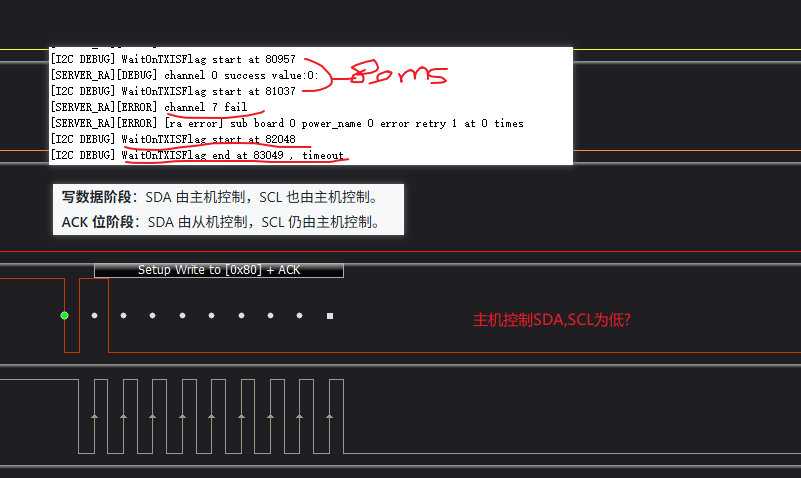
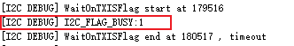
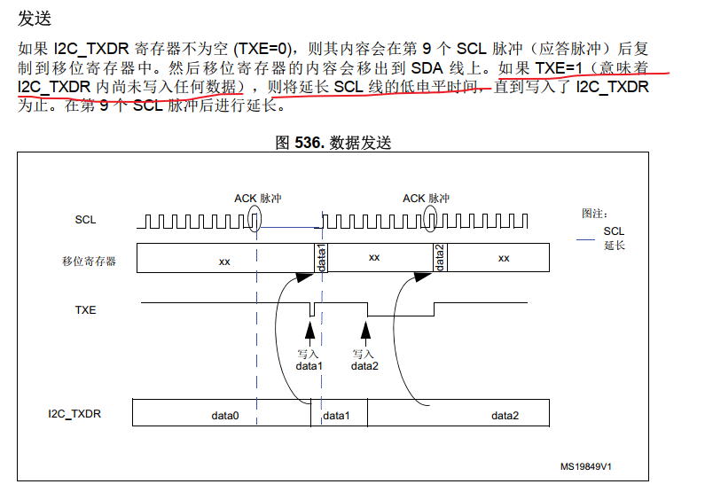
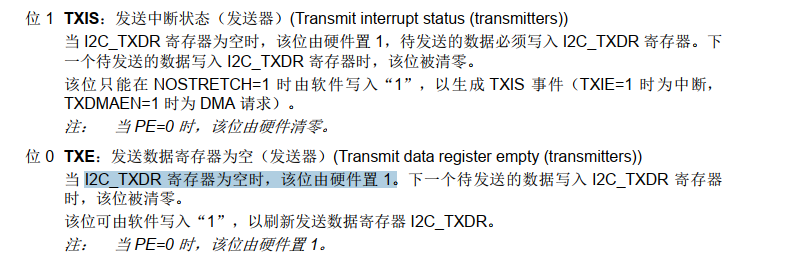
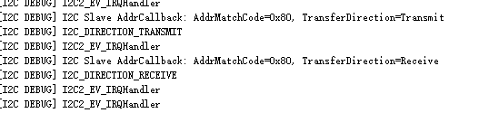

# STM32设置为I2C从机模式（HAL库版本）

## 1、初始化I2C配置
注：除了最后的HAL_I2C_EnableListen_IT()函数，其他代码都可以用STM32CubeMX自动生成
参考代码：
```c
static void MX_I2C1_Init(void)
{
  hi2c1.Instance = I2C1;                                // 配置I2C1                   
  hi2c1.Init.ClockSpeed = 100000;                       // 时钟频率：100k                            
  hi2c1.Init.DutyCycle = I2C_DUTYCYCLE_2;               // 占空比：1/2                                    
  hi2c1.Init.OwnAddress1 = 0x80;                        // 本机地址：0x80（若作为从设备则是从机地址）                           
  hi2c1.Init.AddressingMode = I2C_ADDRESSINGMODE_7BIT;  // 地址模式：7位                                                 
  hi2c1.Init.DualAddressMode = I2C_DUALADDRESS_DISABLE; // 禁止双地址                                                  
  hi2c1.Init.OwnAddress2 = 0;                           // 第二地址                        
  hi2c1.Init.GeneralCallMode = I2C_GENERALCALL_DISABLE; // 禁止广播                                                  
  hi2c1.Init.NoStretchMode = I2C_NOSTRETCH_DISABLE;     // 禁止时钟拉伸                                              
  if (HAL_I2C_Init(&hi2c1) != HAL_OK)    // I2C1初始化                                                  
  {                                                      
    Error_Handler();                                                      
  }                                                      
  //状态：HAL_I2C_STATE_LISTEN      ACK地址，使能I2C_IT_EVT和I2C_IT_ERR中断
  //
  HAL_I2C_EnableListen_IT(&hi2c1);
}
```
## 2、初始化I2C引脚和中断
参考代码：
注：这个代码可以用STM32CubeMX自动生成
```c
void HAL_I2C_MspInit(I2C_HandleTypeDef* hi2c)
{
  GPIO_InitTypeDef GPIO_InitStruct = {0};
  if(hi2c->Instance==I2C1)
  {
    // 配置GPIO
    __HAL_RCC_GPIOB_CLK_ENABLE();   
    GPIO_InitStruct.Pin = GPIO_PIN_6|GPIO_PIN_7;
    GPIO_InitStruct.Mode = GPIO_MODE_AF_OD;
    GPIO_InitStruct.Pull = GPIO_NOPULL;
    GPIO_InitStruct.Speed = GPIO_SPEED_FREQ_VERY_HIGH;
    GPIO_InitStruct.Alternate = GPIO_AF4_I2C1;
    HAL_GPIO_Init(GPIOB, &GPIO_InitStruct);

    // 配置I2C中断
    /* Peripheral clock enable */
    __HAL_RCC_I2C1_CLK_ENABLE();
    /* I2C1 interrupt Init */
    HAL_NVIC_SetPriority(I2C1_EV_IRQn, 0, 0);  // 事件中断（必须有）
    HAL_NVIC_EnableIRQ(I2C1_EV_IRQn);
    HAL_NVIC_SetPriority(I2C1_ER_IRQn, 0, 0);  // 错误中断（非必须）
    HAL_NVIC_EnableIRQ(I2C1_ER_IRQn);
  }
}
```
## 3、配置I2C中断服务函数
参考代码：
注：这个代码可以用STM32CubeMX自动生成
```c
// I2C1事件中断服务函数（必须有）实际的数据接收流程
void I2C1_EV_IRQHandler(void)
{
  HAL_I2C_EV_IRQHandler(&hi2c1);
}

// I2C1错误中断服务函数（非必须）
void I2C1_ER_IRQHandler(void)
{
  HAL_I2C_ER_IRQHandler(&hi2c1);
}

// 侦听结束回调，侦听模式退出时触发

//侦听结束的触发条件
//主机通信结束（如STOP信号产生）。
//通信过程中出现错误（如仲裁丢失、总线错误等）。
//用户主动调用 HAL_I2C_DisableListen_IT() 退出侦听模式。
void HAL_I2C_ListenCpltCallback(I2C_HandleTypeDef *hi2c)
{
    // 通信结束，清理状态，准备下一次侦听
    first_byte_state = 1;
    offset = 0;
    I2C_DEBUG("HAL_I2C_ListenCpltCallback\r\n");
    HAL_I2C_EnableListen_IT(hi2c); // 重新进入侦听模式
}

// I2C设备地址回调函数（从机ACK主机发的地址才会进该函数）
void HAL_I2C_AddrCallback(I2C_HandleTypeDef *hi2c, uint8_t TransferDirection, uint16_t AddrMatchCode)
{
  if(TransferDirection == I2C_DIRECTION_TRANSMIT) 
  {// 主机发送，从机接收
    if(first_byte_state) 
    {
      //只是配置好接收缓冲区和参数，
      //实际的数据接收流程是由 I2C 事件中断服务函数 HAL_I2C_EV_IRQHandler 完成的。
      // 准备接收第1个字节数据
      HAL_I2C_Slave_Seq_Receive_IT(hi2c, rx_buf, 1, I2C_NEXT_FRAME);
    } 
  }
  else
  {

  }
}
//从机收到主机数据，数据接收完成后，HAL库会调用 HAL_I2C_SlaveRxCpltCallback。
//如果主机发送 STOP 信号，或者侦听模式结束，才会进入 HAL_I2C_ListenCpltCallback。

//主机发送的数据长度与从机预期一致，所有数据字节都已收到。
//I2C事件中断服务函数（如 HAL_I2C_EV_IRQHandler）检测到接收完成（缓冲区填满），自动调用 HAL_I2C_SlaveRxCpltCallback。

//HAL_I2C_SlaveRxCpltCallback 是数据接收完成的回调函数，说明本次配置的接收缓冲区已经填满。


void HAL_I2C_SlaveRxCpltCallback(I2C_HandleTypeDef *hi2c)
{

}
```


# 问题排查
## ⚡问题1:主机阻塞1000ms发送,等待TXIS flag超时


TXIS（Transmit Interrupt Status）是 I2C 外设在发送模式下，当发送数据寄存器（TXDR）为空并准备好接收新数据时置位的标志。
当 I2C_TXDR 寄存器为空时，该位由硬件置 1，待发送的数据必须写入 I2C_TXDR 寄存器。下一个待发送的数据写入 I2C_TXDR 寄存器时，该位被清零。

### 🔍 分析1:总线被占用或挂起
SDA/SCL 被其他设备拉低（总线忙）。
I²C 外设处于 BUSY 状态，需要软件复位 I²C 外设
#### 排查 timeout时打印busy位

#### ✨ 结论：busy位置1,i2c总线被拉低
##### 分析1 
##### 排查1 打印TXIS为0，TXE为1
##### 分析1.1 TXIS和TXE应一样，TXIS有问题改为TXE为0时while循环等待timeout
##### 排查1.1 WaitOnSTOPFlagTimeout
##### 分析2 从机监听到开始发送而不是接收
##### 排查2 从机发送和接收中断打印排除分析2
 不是分析2

##### 分析3 从机中断流程还未结束
##### 排查3 加大timout时间100000 问题依旧


软件复位 I²C 外设的方法
禁用 I²C 外设
__HAL_I2C_DISABLE(&hi2c1);
将 SCL 配为 GPIO 输出，手动产生 9 个时钟脉冲，尝试让从机释放 SDA
重新配置 SDA/SCL 为 I²C 功能
重新使能 I²C 外设
__HAL_I2C_ENABLE(&hi2c1);

## ⚡问题2:主机发送地址和发送数据之间有31ms间隔 
### 🔍 分析1:有中断
关闭中断尝试，i2c走不下去，应该是依赖全局中断