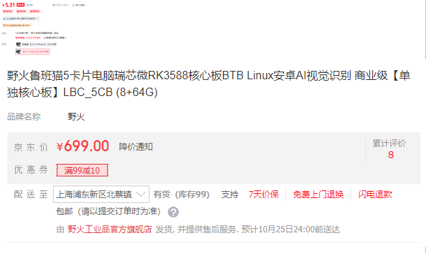
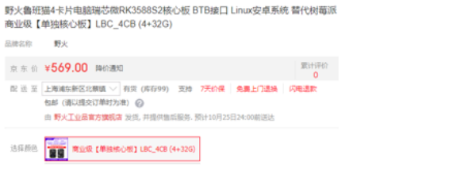
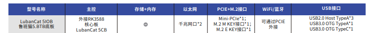
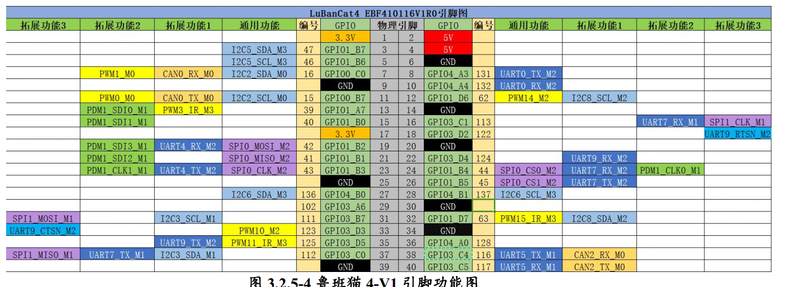

# 鲁班猫版本
背面右下角

用户  --- 用户名 -- 密码
超级用户 - root -- root
普通用户 - cat  -- temppwd
## 硬件参数和硬件示意图
【野火电子】鲁班猫系列产品选型手册20250208.pdf
## 系统Debian
乌班图和德边
Debian 的底线： “如果它不自由、不稳固，它就不属于 Debian。”
Ubuntu 的底线： “如果用户用不起来，那这个系统就没有意义。”
## RK3588
RK3588 采用 8nm 制程工艺，性能强劲且功耗低：

‌CPU‌：8 核设计（4 个 Cortex-A76 @ 2.4GHz + 4 个 Cortex-A55 @ 1.8GHz），多任务处理流畅。‌‌
‌GPU‌：Mali-G610 MC4，支持 8K 视频解码和 3D 图形渲染（如 OpenGL ES 3.2/Vulkan 1.2）。‌‌
‌NPU‌(Neural Processing Unit)：6 TOPS 算力，可加速 AI 模型（如人脸识别），支持 INT4/INT8/FP16 混合运算。‌‌
‌视频能力‌：
解码：8K@60fps（H.265/VP9）、4K@60fps（AV1）。
编码：8K@30fps（H.264/H.265）
##
SPI应用层,直接调驱动
## pin定义

rk3588具有5个GPIO控制器，每个控制器可以控制32(A=0,B=1,C=2,D=3,8个索引号)个IO

Rockchip Pin的ID按照 控制器(bank)+端口(port)+索引序号(pin) 组成。
GPIO1_C4表达的意思为第1组控制器，端口号为C，索引号为4。该引脚号的计算公式为32 x 1 + 2 x 8 + 4 = 52

## 外设控制
### IO配置
eg
pin7为32×0+0×8+7 GPIO0_A7

以下所有操作均需要打开管理者权限使用
#使能引脚GPIO1_C4
echo 7 > /sys/class/gpio/export

#设置引脚为输入模式
echo in > /sys/class/gpio/gpio7/direction
#读取引脚的值
cat /sys/class/gpio/gpio7/value

#设置引脚为输出模式
echo out > /sys/class/gpio/gpio52/direction
#设置引脚为低电平
echo 0 > /sys/class/gpio/gpio52/value
#设置引脚为高电平
echo 1 > /sys/class/gpio/gpio52/value

#复位引脚
echo 52 > /sys/class/gpio/unexport
#### 查看所有已配置的 PIN 状态
sudo cat /sys/kernel/debug/pinctrl/pinctrl-rockchip-pinctrl/pinmux-pins

### spi
vi /boot/uEnv/board.txt
将带有 xxx-spix-mx-overlay.dtbo 的两行的注释符号去掉
xxx-spix-mx-overlay.dtbo是使用了硬件cs片选
xxx-spix-mx-gpio-cs-overlay.dtbo是使用了GPIO模拟片选
ls /dev/spi*
 SPI_0对应的设备文件是spidev0.0和spidev0.1
 spidev0.0和spidev0.1的区别在于片选信号的不同，spidev0.0使用CS0 , spidev0.1使用CS1
 如果是直接拔电源的方式重启，会有可能出现文件没能做出修改 （原因：文件未能及时从内存同步到存储设备中，解决方法，在终端上输入 “sync” 再拔电关机）

## 工程软件架构
用户：在网页 dashboard.html 点按钮。
前端：发送 POST 请求到 routes.py 的 /run_lua。
引擎：lua_engine.py 创建一个新线程和新 Lua 虚拟机。
注入：引擎把 hal_power.py 里的 power 实例用 LockedHalProxy 包装后，塞给 Lua 全局变量 g.power。
运行：lua.execute(code) 开始运行你的 Lua 脚本。
中转：Lua 调 power:set_xxx -> 触发 LockedHalProxy -> 拿到互斥锁 -> 调 hal_power.py。
落地：你的 hal_power.py 通过 SpiDriver 向 SPI 线路发送物理电信号。

## 日志
logger.error(f"HAL initialization failed: {e}") # <--- 你的报错日志就是这里打印的