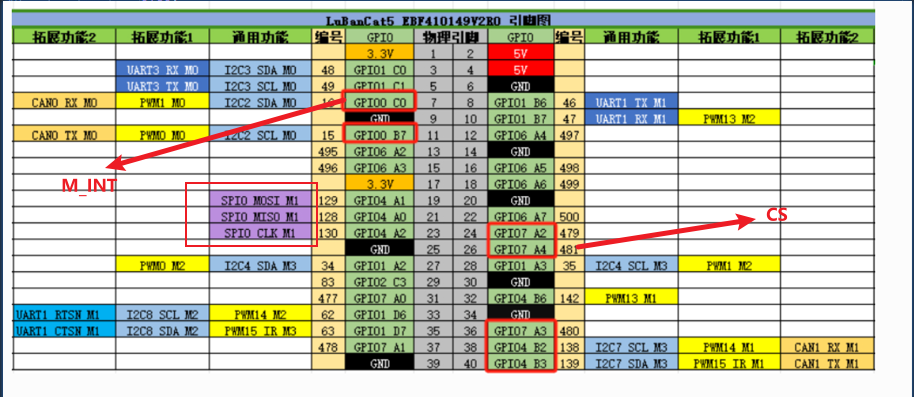

# GCV5 SERVICE使用方法及硬件连接

## 软件部分

sudo apt update
sudo apt install python3 python3-pip python3-venv -y
python3 -m venv venv
pip install -r requirements.txt -i <https://pypi.tuna.tsinghua.edu.cn/simple>
cp .env.example .env
ADMIN_TOKEN=$(python3 -c "import secrets; print(secrets.token_hex(32))")
JWT_SECRET=$(python3 -c "import secrets; print(secrets.token_hex(32))")
sed -i "s|^GCV5_ADMIN_TOKEN=.*|GCV5_ADMIN_TOKEN=${ADMIN_TOKEN}|" .env
sed -i "s|^GCV5_JWT_SECRET_KEY=.*|GCV5_JWT_SECRET_KEY=${JWT_SECRET}|" .env
chmod 600 .env

### SPI外设要开启

sudo fire-config
选中外设
使用方向键移动光标到 SPI 。
按 “空格键” 选中SPI-CS(出现 “*” )，如下图。
按 “确认键” 进行设置。
按 “Esc键” 退出到终端，
!!!!运行 sudo reboot 进行重启应用。

### 开机自启动

1)新建服务文件gcv5.service
sudo nano /etc/systemd/system/gcv5.service
<!-- nano (奈-no)简单,屏幕底部有常用快捷键提示  vim(维-m)复杂-->
<!-- Linux 下 systemd 管理自定义服务的标准目录。 -->
内容如下
[Unit]
Description=GCV5 Service
After=network.target

[Service]
Type=simple
User=cat
WorkingDirectory=/home/cat/gcv5_service
ExecStart=/bin/bash run_server.sh DEBUG
Restart=always

[Install]
WantedBy=multi-user.target

<!-- [Unit]：服务单元的基本信息。 -->
<!-- Description：服务的描述，随便写，方便识别。
After=network.target：表示网络启动后再启动本服务。 -->
2)重新加载 systemd 并启用服务
sudo systemctl daemon-reload
<!-- 当你在 system 目录下新建、修改或删除了服务文件（如 gcv5.service）后，systemd 默认不会自动检测这些变化。
这时需要执行：daemon-reload 是 systemctl 的一个命令，用于让 systemd 重新加载服务管理器的配置文件。 -->
sudo systemctl enable gcv5
<!-- 设置服务为开机自启 -->
sudo systemctl start gcv5
3) 查看服务状态
sudo systemctl status gcv5
4)日志查看
journalctl -u gcv5 -f
<!-- journalctl：用于查看 systemd 管理的服务日志。
-u gcv5：指定只查看名为 gcv5 的服务（即你刚才创建的 gcv5.service）。
-f：-f：--follow，实时跟踪日志输出（follow） 实时跟踪日志输出（类似 tail -f），可以看到服务运行时不断产生的新日志。 -->
## 硬件部分

### SPI和同步IO连线

### 5.0电源板给鲁班猫EBF410149V2R2 供电

接5V
共地

### 开始

 sudo sh run_server.sh
