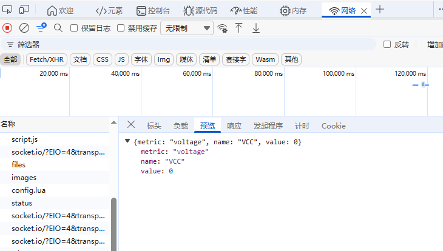
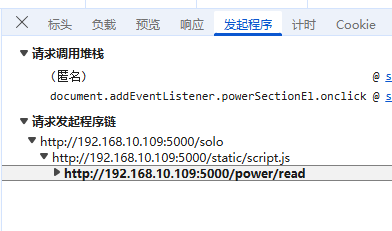

## Flask介绍
Flask 是一个用 Python 编写的轻量级 Web 应用框架

定位： Flask 通过 __name__ 知道 app.py 放在 /my_project 这个文件夹里。
自动关联： 知道了这个位置后，Flask 就会自动推断出：
HTML 模板一定在 /my_project/templates。
图片和 CSS 一定在 /my_project/static


## 抓取前端发送给后端的这些 JSON 数据包（HTTP 请求）

### 浏览器
1)在浏览器（Chrome/Edge）中按 F12 或右键“检查”。
2)切换到 Network (网络) 标签页。


### wireshark
wireshark
http.request.method == "POST" && tcp.port == 5000
### 代码
1.在 routes.py:1272 的 files_post 函数中。这里是 Flask 接收到原始 JSON 数据的地方
```python
# [web/routes.py] 约 1272 行
def files_post(name):
    try:
        body = request.get_json(force=True, silent=True) or {}
        content = body.get("content", "")
        
        # 在这里添加打印
        if "config.lua" in name:
            logger.info(f"POST /files/{name} received content")
            # 或者直接 print
            # print(content)
            
        # ... 原有代码 ...
```
2 建议在 Dispatcher 层打印 (最直接)
在 dispatcher.py:510 的 _file_save 方法中添加打印。这里是所有文件保存请求的必经之路。
```python

# [core/dispatcher.py] 约 510 行
def _file_save(self, params: Dict[str, Any], context: Dict[str, Any]) -> Any:
    filename = params.get("filename")
    content = params.get("content", "")
    
    # 在这里添加打印
    if "config.lua" in filename:
        print(f"DEBUG: Saving config.lua, content length: {len(content)}")
        print(f"DEBUG: Content received:\n{content}")
    
    # ... 原有代码 ...
```
### 网页端解释


## 流程解析

### read power voltage


1)网页地址
solo 指的是网页的地址

2)找路由
然后去代码里找路由
在 routes.py 中搜索 @app.route("/solo")。
```python
@api_bp.route("/solo")
@login_required
def solo_node():
    return render_template("index.html")
```
当你访问 http://192.168.10.109:5000/solo 时，后端会返回 index.html 模板文件。

4)js的加载运行
```python
<script src="{{ url_for('static', filename='script.js') }}"></script>
```
这里的 url_for('static', filename='script.js') 会被 Flask 自动解析为地址 http://192.168.10.109:5000/static/script.js。

5)脚本 script.js 运行后，通过上面的 fetch 代码，
eg1 向服务器请求了 /power/read 这个接口的数据。

eg2 请求/files 接口

前端脚本调用 fetch('/files/init_code/config.lua')
后端路由分发 @api_bp.route("/files/<path:name>", methods=["POST"]) 标头请求方法

## 蓝图教程

蓝图的作用：给不同的功能小组（如 API 组、用户组、静态页面组）分配独立的办公室（文件），最后再由前台（app.py）统一登记。

### 1. 蓝图的定义

创建蓝图对象
'api': 蓝图的名字（用于内部通过 url_for 查找）
__name__: 确定蓝图所在的位置，方便查找 templates 和 static 文件夹命名
api_bp = Blueprint('api', __name__)
空间隔离,如果你有多个蓝图，它们可以有同名的函数而互不干扰(如api_bp.login,user.login)：在注册蓝图时，通过 url_prefix 可以强行隔离不同小组的接口如app.register_blueprint(api_bp, url_prefix='/api')API 组的访问路径是：http://localhost:5000/api


### 2. 在蓝图上“贴标签” (定义路由)

你不再使用 @app.route，而是使用 @api_bp.route。这意味着这些路径现在属于这个“小组”：
```python
@api_bp.route("/solo")
def solo_node():
    return render_template("index.html")

@api_bp.route("/power/set", methods=["POST"])
def power_set():
    # ... 设置电压的逻辑
    return jsonify({"success": True})
```
### 3. 注册蓝图 (核心，决定了网址长什么样)
蓝图定义好了，但 Flask 还不知道它的存在。你必须在创建 App 的地方（通常是 app.py）注册它。
```python
from web.routes import api_bp
app.register_blueprint(api_bp)
```
结果：网址直接对应。@api_bp.route("/solo") 
http://localhost:5000/solo。

## return render_template("index.html")
这是最关键的一步，它像是一条链条的开头，触发了后续所有的硬件操作：

加载 HTML：服务器从 index.html 读取内容并发送给浏览器。这个 HTML 文件定义了你看到的电源控制按钮、仪表盘布局等界面。
触发静态资源加载：
浏览器解析 index.html 时，会发现里面引用了 script.js。
一旦 script.js 加载成功，它就会开始执行你在前面抓包看到的那些 power/read、status.get 等 API 请求。


##  
