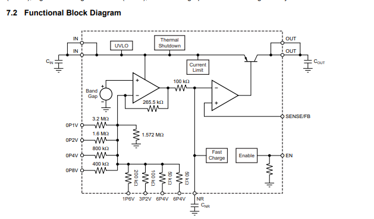
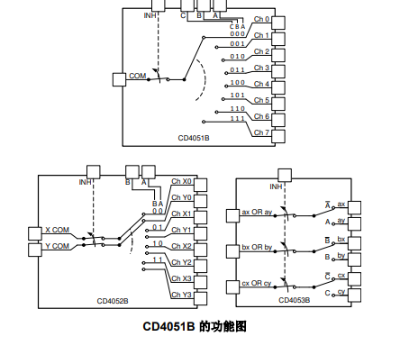
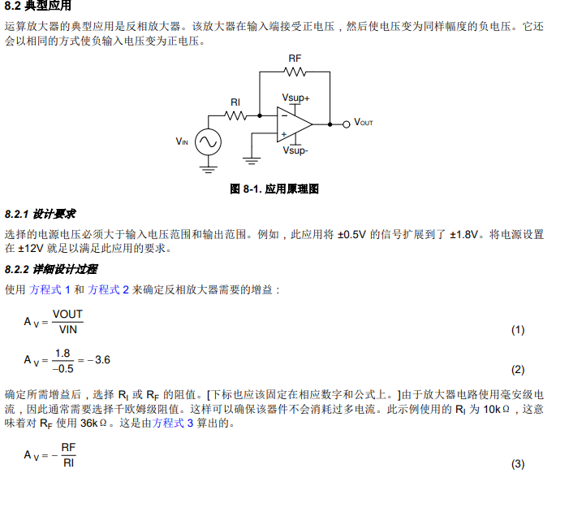
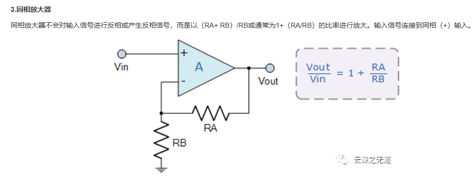
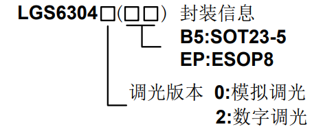

## 1 LDO TPS7A4701RGWR

### LDO Input and Output Voltage Calculation Formula

### Internal Principles of LDO

## 2 CD4051BPWR

## 3 运算放大器

### 3.1 反相放大器 
该放大器在输入端接受正电压，然后使电压变为同样幅度的负电压。它还会以相同的方式使负输入电压变为正电压。

### 3.2 同相放大器

### 3.3 开环增益（开环放大倍数，A_ol）：
运放在不接外部反馈（即“开环”）时，输出对差分输入电压的放大倍数。数学上：
V_out = A_ol × (V+ − V−)。理想运放 A_ol 很大（十万到百万量级）；实际运放随频率下降。
### 3.4 闭环增益（闭环放大倍数，A_cl）：
在接入反馈网络后，实际电路对输入的放大倍数。对于负反馈系统，闭环增益由运放与反馈因子 β 共同决定，精确关系为：
A_cl = A_ol / (1 + A_ol·β)。
当 A_ol → ∞ 时，A_cl ≈ 1/β（即闭环由反馈网络决定，与运放本身无关）。
常见结果（直观公式）：
反相放大器：A_cl = −R_f / R_in（由电阻比决定，负号表示相位翻转）
同相放大器：A_cl = 1 + R_f / R_g（由电阻比决定）
电压跟随（缓冲）：A_cl = 1（β = 1）
### 3.5 什么是单位增益带宽（GBW）Unity Gain Bandwidth：
这是运放在闭环增益为 1（跟随器）时还能保持有效放大的最高频率
### 3.6 其他几种电路的链接
https://cloud.tencent.com/developer/article/2290991

## 4 LGS63042B5 (60V 降压型、升降压型 LED 恒流驱动器)

LGS63042 支持数字输入（100HZ~100KHZ）的PWM 调光，高频 PWM 输入下无屏闪。调光比在PWM 频率为 100HZ 时高达 25000:1。
LED 的亮度是由PWM 信号的占空比决定的。例如 PWM 信号 25%占空比，LED 的平均电流为(0.2/RSence)的 25%。建议设置PWM 调光频率在 120Hz 以上，以避免人的眼睛可以看到 LED 的闪烁

肖特基二极管具有较低的正向电压降和较快的开关速度，
https://cloud.tencent.com/developer/article/2028590

## 5.TCA9554 I2C 总线 8 位并行接口扩展芯片

1. TCA9554 的 7 位固定地址
根据 TCA9554 的芯片手册，它的 7 位地址高位是固定的 0100，剩下的低 3 位由硬件引脚 
计算公式：[ 0 1 0 0 ] [ A2 ] [ A1 ] [ A0 ] 
2. 带入你的硬件连接（A2=0, A1=1, A0=1）
按照你的硬件设定，这 7 位地址就是：

二进制：0 1 0 0 0 1 1
十六进制：将其转换为 16 进制即 0x23
3. 生成 8 位“写”地址（0x46）
在 I2C 通讯中，CPU 发送的第一个字节必须包含读/写方向（最低位 LSB）：

Bit 0 = 0：代表写操作 (Write)
Bit 0 = 1：代表读操作 (Read)
4. 
Pin 14, 15 (SCL, SDA)：连接到 STM32 的 I2C 总线，像电话线一样接收命令。
Pin 4, 5, 6, 7, 9, 10, 11, 12 (P0 - P7)：这是它变出来的 8 个 GPIO 引脚。
Pin 1, 2, 3 (A0, A1, A2)：地址选择引脚。你的代码能通，说明这三个脚在硬件上接的是：A0=1, A1=1, A2=0（对应写地址 0x46）。

5. 内部寄存器映射
该芯片只有 4 个关键寄存器：

寄存器地址	名称	描述
0x00	Input Port	只读。反映当前引脚的逻辑电平。
0x01	Output Port	可读写。设置输出模式下的引脚电平。
0x02	Polarity Inversion	可读写。设为 1 时，输入电平取反。
0x03	Configuration	可读写。0 = 输出，1 = 输入（默认为全 1，即输入）。

##示波器
zoom:
按确定 确定T放大1000倍T的位置
触发:
<!-- 脉宽触发:当信号的高电平或低电平持续时间（脉宽）大于、等于或小于设定值时触发
欠幅触发:当信号电压低于（或高于）某个阈值时触发，或信号进入/离开某个电压窗口时触发 -->
触发的模式:
<!-- 自动（Auto）：没有触发信号时也会自动刷新显示，方便观察连续信号。
正常（Normal）：只有满足触发条件时才采集波形，否则屏幕保持不变。
单次（Single）：只触发一次，采集一帧波形后停止，适合捕获一次性事件
触发“释抑时间”，即两次触发之间的最小等待时间。在释抑时间内，示波器不会响应新的触发信号。 -->
带宽:
<!-- 是输入正弦波幅度衰减至原值 70.7%（-3dB）时的最高频率
0.707的平方=0.5
-3dB = 信号功率衰减 50% -->
<!-- tr=0.35/BW(GHZ)
小于tr时间的上升沿看不到 -->
采样深度（Record Length）
<!-- 决定了每次采集波形时能存多少个采样点。采样深度越大，能看到的波形细节越多，单次捕获的时间窗口也越宽 -->
采样深度 ÷ 采样率 = 采样时间窗口。